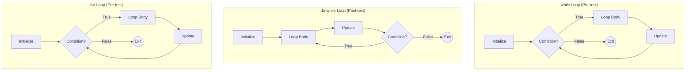
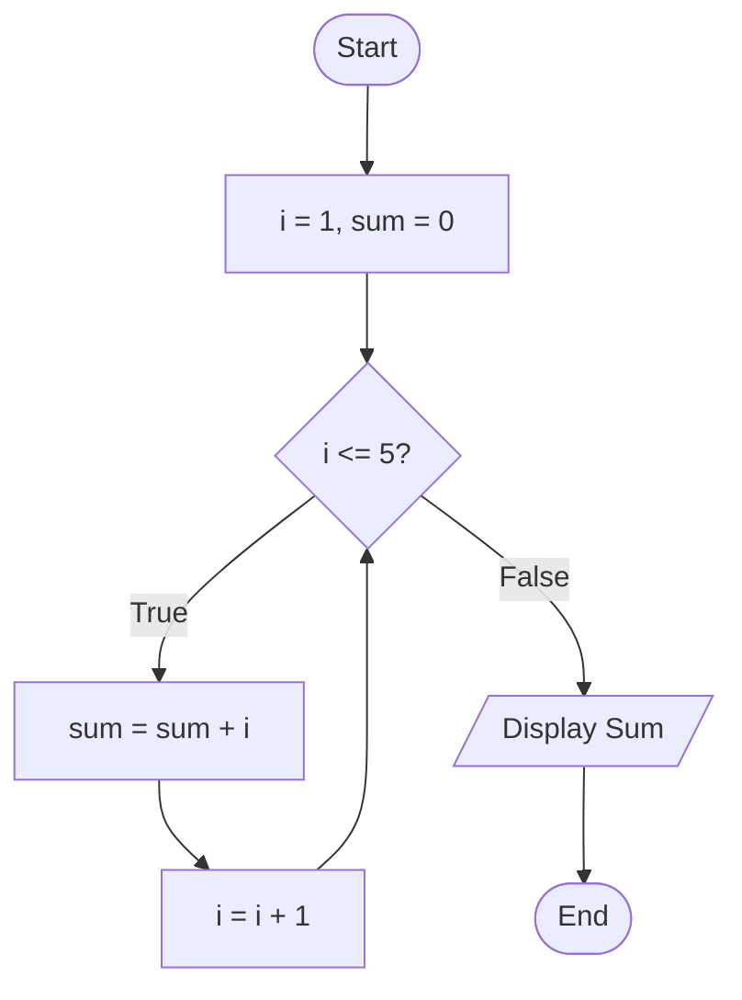
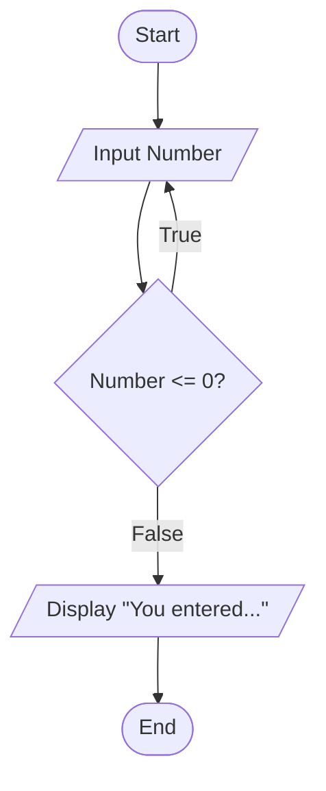
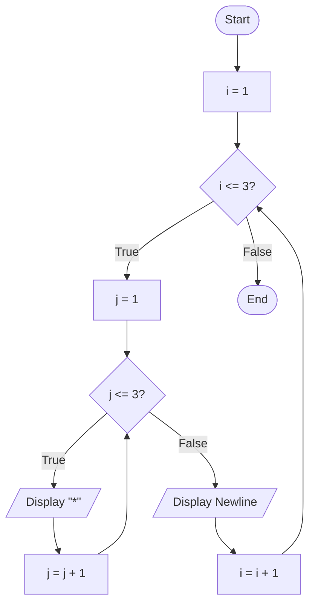

## Visualizing Logic: Flowcharts for Loops

Flowcharts are especially useful for understanding how loops control the flow of a program. They clearly illustrate the repetition, the condition that sustains it, and the point of exit.

<div style="position:fixed;bottom:0;right:250px;padding-bottom:10px">



</div>


---
layout: two-cols
---

## Flowcharting the `while` Loop

<Transform scale="0.8">

A `while` loop uses a **pre-test** condition. The condition is checked *before* the loop body is executed. If the condition is false initially, the loop will not run at all.

**Example: Sum of Numbers 1 to 5**
This flowchart shows the initialization, the condition check, the repeated body (summation and increment), and the final exit.

```c
#include <stdio.h>

int main() {
    int i = 1;
    int sum = 0;

    // Condition is checked before each iteration
    while (i <= 5) {
        sum += i;
        i++; // Update moves toward exit condition
    }

    printf("Sum = %d\n", sum); // Prints 15

    return 0;
}
```

</Transform>

:: right ::

<Transform scale="0.75">


</Transform>

---
layout: two-cols
---

## Flowcharting the `do-while` Loop

<Transform scale="0.78">

A `do-while` loop uses a **post-test** condition. The loop body is always executed *at least once*, and the condition is checked *after* the body runs.

**Example: Input Validation**
This is a classic use case for `do-while`. The program must get input from the user *before* it can validate it. The loop continues until valid input is received.

```c
#include <stdio.h>

int main() {
    int number;

    do {
        // Body executes at least once
        printf("Enter a positive number: ");
        scanf("%d", &number);
    } while (number <= 0); // Condition checked after

    printf("You entered: %d\n", number);

    return 0;
}
```

</Transform>

:: right ::

<Transform scale="0.75">


</Transform>

---
layout: two-cols
---

## Flowcharting the `for` Loop

<Transform scale="0.8">

The `for` loop is logically equivalent to a `while` loop. It simply combines the initialization, condition, and update steps into a more compact syntax, making it ideal for counter-controlled loops.

**Example: Sum of Numbers 1 to 5**
The flowchart for this `for` loop is identical to the `while` loop's flowchart, demonstrating their logical similarity.

```c
#include <stdio.h>

int main() {
    int i;
    int sum = 0;

    // Initialization, condition, and update
    // are all in one line.
    for (i = 1; i <= 5; i++) {
        sum += i;
    }

    printf("Sum = %d\n", sum); // Prints 15

    return 0;
}
```

</Transform>

:: right ::

<Transform scale="0.75">


</Transform>

---
layout: two-cols
---

## Flowcharting Nested Loops

<Transform scale="0.8">

A nested loop is a loop inside another loop. The inner loop completes all its iterations for each single iteration of the outer loop.

**Example: Printing a 3x3 Grid**
The outer loop controls the rows, and the inner loop controls the columns. The flowchart clearly shows the inner loop (j) cycling completely before the outer loop variable (i) is incremented.

```c
#include <stdio.h>

int main() {
    int i, j;

    // Outer loop for rows
    for (i = 1; i <= 3; i++) {
        // Inner loop for columns
        for (j = 1; j <= 3; j++) {
            printf("* ");
        }
        // After inner loop, print a newline
        printf("\n");
    }
    return 0;
}
```

</Transform>

:: right ::

<Transform scale="0.6">



</Transform>