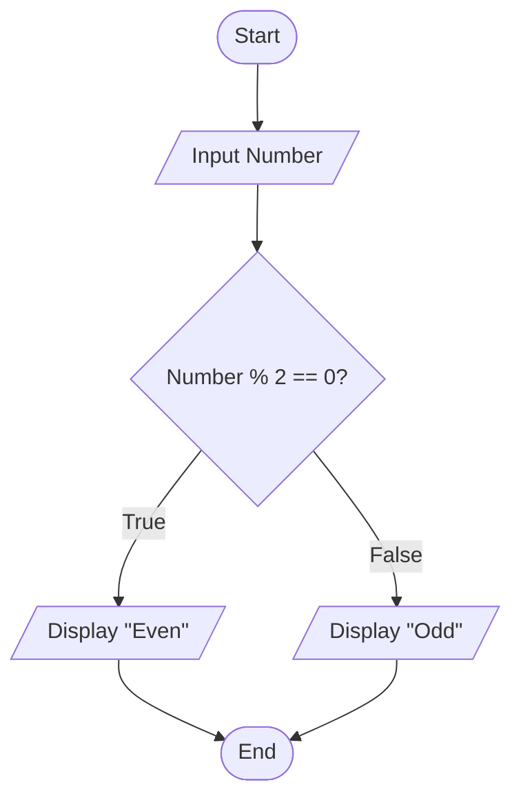
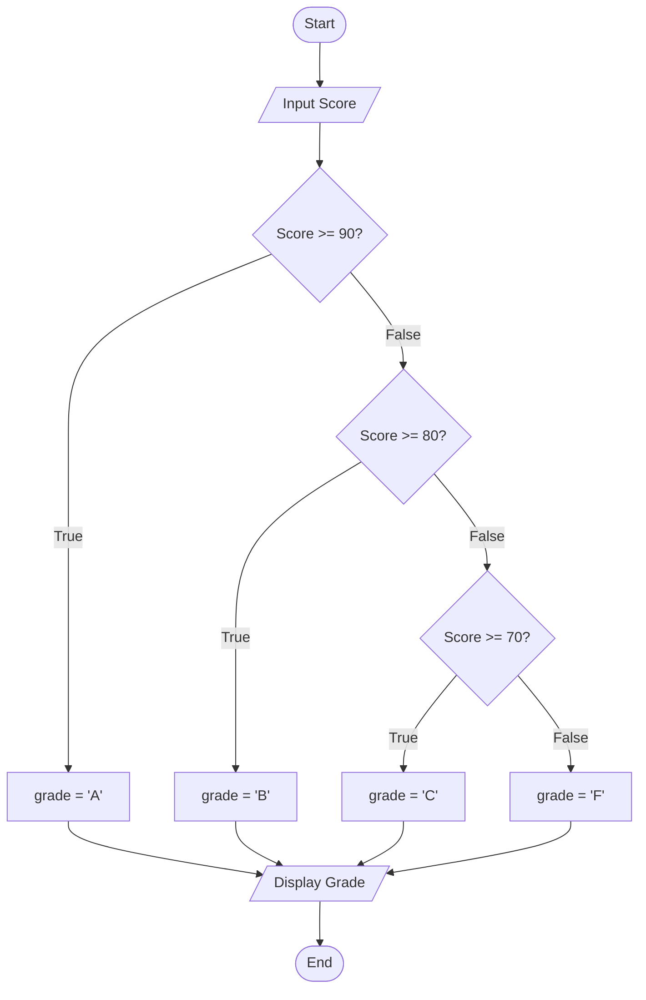
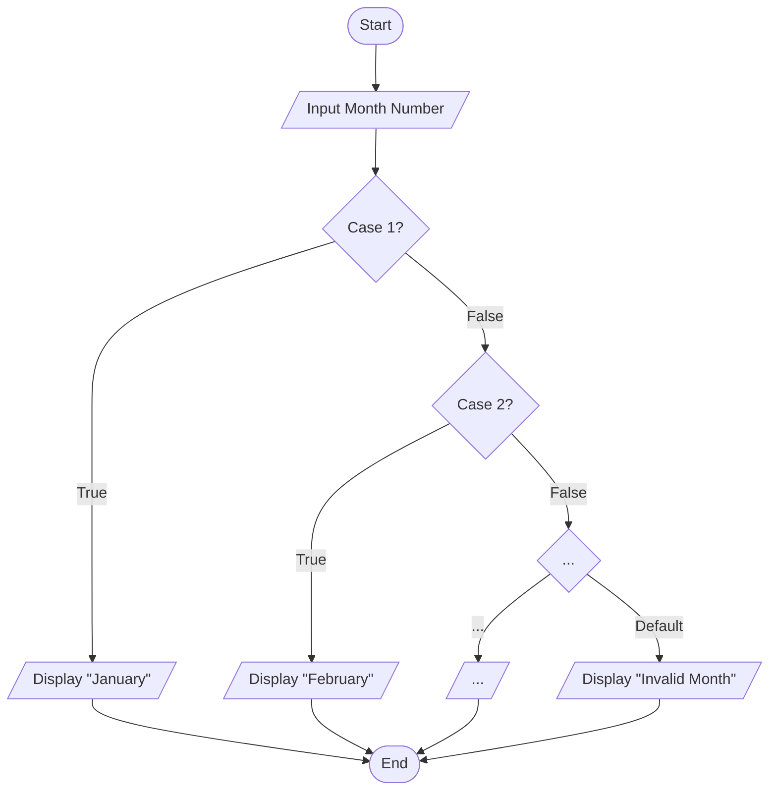

## Visualizing Logic: Introduction to Flowcharts

Before writing complex code, it's helpful to visualize the program's logic. A **flowchart** is a diagram that represents the step-by-step flow of a program.

**Why use flowcharts?**

* **Planning:** They help you think through and plan the logical sequence of steps.
* **Clarity:** They provide a clear visual map of how the program works, making it easier to understand and debug.
* **Communication:** They are a standardized way to share and discuss your program's design with others.

Flowcharts use a set of standard symbols to represent different types of actions and decisions.

---
layout: default
---
## Standard Flowchart Symbols

These are the fundamental symbols you'll use to map out your program's logic.

<Transform scale="0.7">

| Symbol | Name | Description |
| :---: | :--- | :--- |
|  | **Terminator (Oval)** | Marks the beginning (**Start**) or end (**End**) of the program. |
|  | **Input/Output (Parallelogram)** | Represents getting data from the user (`scanf`) or displaying information (`printf`). |
|  | **Process (Rectangle)** | Represents any operation or calculation (e.g., `area = PI * r * r;`). |
|  | **Decision (Diamond)** | Represents a point where the program must make a choice (`if`), leading to true/false paths. |
|  | **Flow Line (Arrow)** | Connects the symbols and shows the direction of program execution. |

</Transform>

---
layout: two-cols
---
## Flowchart for Sequential Execution

<Transform scale="0.72">

Sequential flow is the most basic structure, where instructions are executed one after another.

**Example: Calculating Circle Area**
This flowchart visualizes the sequential steps of reading a radius, calculating the area, and displaying the result.


```c
#include <stdio.h>

int main() {
    // Define PI as a constant value
    const float PI = 3.14159;
    float radius;
    float area;

    // Get the radius from the user
    printf("Enter the radius of the circle: ");
    scanf("%f", &radius);

    // Calculate the area using sequential steps
    area = PI * radius * radius;

    // Display the final result
    printf("The area of the circle is: %f\n", area);

    return 0;
}
```
</Transform>
:: right ::

```mermaid
graph TD
    A([Start]) --> B[/Input Radius/];
    B --> C[area = PI * radius * radius];
    C --> D[/Display Area/];
    D --> E([End]);
````

---
layout: two-cols
---

## Flowcharting the `if-else` Statement

<Transform scale="0.65">

The **Decision** diamond is used to represent an `if-else` condition. The program follows one of two paths based on whether the condition is true or false.

**Example: Even or Odd Number**
This flowchart checks if a number is even. If `true`, it displays "Even". If `false` (the `else` path), it displays "Odd". Both paths then merge to continue the program.


```c
#include <stdio.h>

int main() {
    int number;

    // Get an integer from the user
    printf("Enter an integer: ");
    scanf("%d", &number);

    // Check if the remainder when divided by 2 is 0
    if (number % 2 == 0) {
        // If the condition is true, the number is even
        printf("%d is an even number.\n", number);
    } else {
        // If the condition is false, the number is odd
        printf("%d is an odd number.\n", number);
    }

    return 0;
}
```

</Transform>

:: right ::

<Transform scale="0.75">


</Transform>

---
layout: two-cols
---

## Flowcharting the nested `if-else` Ladder

<Transform scale="0.63">

**Example: Grading**
This flowchart assigns a grade based on a score. The logic flows downwards, checking each condition until one is met or the final `else` case is reached.

```c
#include <stdio.h>

int main() {
    int score;
    char grade;

    // 1. Get score from user
    printf("Enter the score: ");
    scanf("%d", &score);

    // 2. Assign grade using an if-else if-else ladder
    if (score >= 90) {
        grade = 'A';
    } else if (score >= 80) { // Only checked if score < 90
        grade = 'B';
    } else if (score >= 70) { // Only checked if score < 80
        grade = 'C';
    } else {                  // Only runs if score < 70
        grade = 'F';
    }

    // 3. Display the final grade
    printf("The grade is: %c\n", grade);

    return 0;
}
```

</Transform>

:: right ::

<Transform scale="0.7">



</Transform>

---
layout: two-cols
---

## Flowcharting the `switch` Statement

<Transform scale="0.68">

**Example: Month Names**
This flowchart shows how `month_num` is evaluated. The flow jumps to the correct `case`. The `default` path is taken if no case matches. All paths merge at the end.

```c
#include <stdio.h>

int main() {
    int month_num;

    // Get input from the user, as shown in the flowchart
    printf("Enter the month number (1-12): ");
    scanf("%d", &month_num);

    // Use a switch statement to handle the different cases
    switch (month_num) {
        case 1:
            printf("January\n");
            break; // Exits the switch
        case 2:
            printf("February\n");
            break;
        // ... 
        default: // Handles any number outside 1-12
            printf("Invalid month number\n");
            break;
    }
    return 0;
}
```

</Transform>


:: right ::



