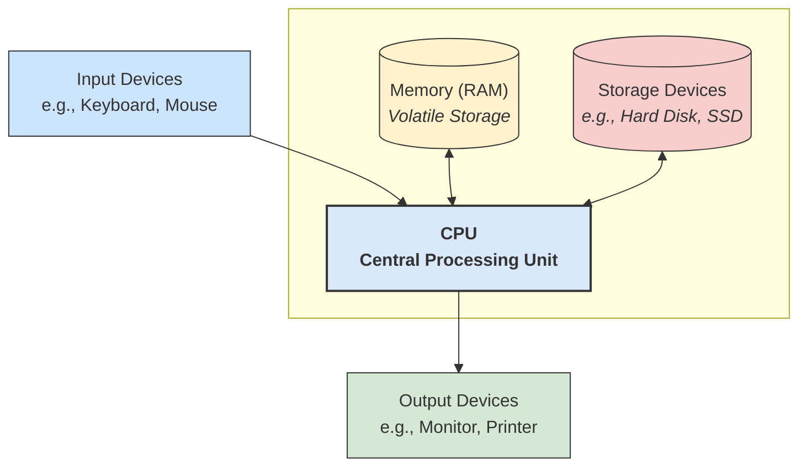
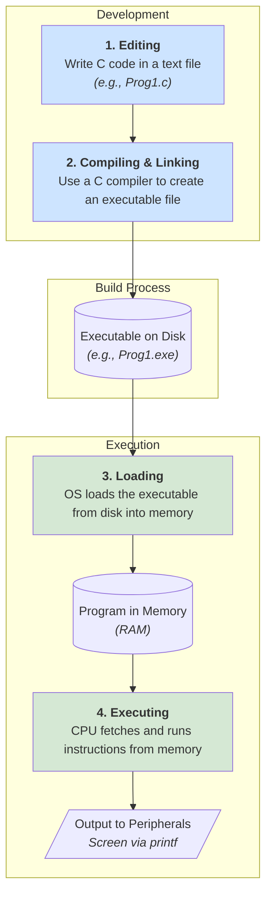

# Computer Programming
## Lecture 1: Introduction and Overview

Presented by: Dr. Ruslee Sutthaweekul

Semester 1/2025

---

## Lecture Outline

1.  **Course Syllabus**
2.  Fundamentals of Computers
3.  Introduction to Programming
4.  C Programming Basics
5.  Development Environments (Editors & IDEs)


---
layout: two-cols
---

## Syllabus Overview

* **Core Topics Covered:**
    * Primitive Data Types and Operations
    * Sequential Program Flow
    * Conditional Logic: `if-else`, `switch`
    * Looping Constructs: `while`, `do-while`, `for`
    * Functions: Declaration, Definition, Calling
    * Preprocessor Directives & Macros (`#ifdef`, etc.)
    * Arrays: Declaration, Definition, Usage
    * Structures: `struct`, `union`
    * Pointers
    * File Input/Output Operations
    * Bitwise Operations
    * Build Tools: `make`, MakeFile, `cmake`, CMakeLists.txt

::right::

* **Performance Evaluation Concepts**
  * **Grading Breakdown:**
    * Project Assignment: 10%
    * Lab Exercises: 20%
    * Attendance: 10%
    * Exam: 60%


---

## Course Structure

* **Lectures:** 12 weeks, 2 hours per week.
* **Labs:** 10 weeks, 2 hours per session.
* **Support:** TA and instructor available during labs.
* **Exams:** Mid-term and Final exams conducted in the exam room (no computer).
    * Format includes 30 multiple-choice questions.
    * Includes 3 coding problems.
* **Policies:** Academic integrity is strictly enforced (no cheating or grade negotiation).
* **Commitment:** Attending all classes is encouraged for maximizing learning.

---

## Lecture Outline

1.  Course Syllabus
2.  **Fundamentals of Computers**
3.  Introduction to Programming
4.  C Programming Basics
5.  Development Environments (Editors & IDEs)

---
layout: image-right
image: https://cdn.britannica.com/10/23610-050-6E34CF6B/portion-Difference-Engine-Charles-Babbage-logarithm-tables-1832.jpg
---

## What is a Computer?

* Essentially, a computer is a machine designed for computation.
* Conceptually, it's not vastly different from older calculating tools like the abacus.
* Throughout history, various machines have been used for calculation:
    * Abacus
    * Difference Engine (Babbage)
    * Tide-predicting machines

---
layout: image-left
image: https://miro.medium.com/v2/resize:fit:720/format:webp/0*W_QPS0HHrjyU9l9p
---

## The Computing Model
* **What defines computing?**
    * Taking input data.
    * Performing necessary operations on that data.
    * Producing an output or answer.
* This fundamental model aligns with concepts proposed by pioneers like Alan Turing and John Von Neumann.

---
layout: two-cols-header
---

## Computer Architecture Framework
::left::
* Let's identify the primary components of a typical computer system:
    * **CPU (Central Processing Unit):** The "brain" performing calculations.
    * **Memory (RAM):** Temporary storage for active data and programs.
    * **Hard Disk/SSD:** Long-term storage.
    * **Input Devices:** Keyboard, Mouse.
    * **Output Devices:** Graphics Card + Monitor/Screen, Sound Card + Speakers.
    * **Communication Paths (Buses):** Address Bus, Data Bus, Instruction Bus connecting components.

::right::

<!-- 
 -->



---
layout: two-cols-header
---


## Identifying Computer Components

* Can you recognize the various internal parts of a computer?

::left::


::right::

List of Components in the Image (Possible Answers):

1.  **CPU (Central Processing Unit)**
2.  **RAM (Random Access Memory) Stick**
3.  **Motherboard**
4.  **Graphics Card**
5.  **Hard Drive (or SSD)**
6.  **Power Supply Unit (PSU)**
7.  **Keyboard**
8.  **Mouse**
9.  **Monitor**
10. **Speakers**

---
layout: image-right
image: /chip.png
---

## Fundamental Chip Elements

* Modern computer chips (Very Large Scale Integrated Circuits - VLSIC) are incredibly complex.
* However, they are built upon two fundamental types of electronic elements:
    * **Gates (e.g., AND, OR, NOT):** Responsible for performing logical operations; the core building blocks of the CPU.
    * **Latches (or Flip-Flops):** Responsible for storing bits of information (memory); the core building blocks of memory components.

---

## Lecture Outline

1.  Course Syllabus
2.  Fundamentals of Computers
3.  **Introduction to Programming**
4.  C Programming Basics
5.  Development Environments (Editors & IDEs)

---

## Why Do We Program?

* Programming allows us to instruct computers.
* Early computing pioneers:
    * **Charles Babbage:** Designed early mechanical computers like the Difference Engine.
    * **Ada Lovelace:** Collaborated with Babbage and is widely regarded as the first computer programmer, developing algorithms for his machines. The Ada programming language is named in her honor.


---

## Computer Instructions

* Fundamentally, programming provides the **instructions** that tell the CPU what to do.
* The CPU fetches both instructions and the necessary **data** from memory.
* After processing, the results are typically sent back to memory.


---
layout: image-right
image: /human_machine.png
---

## Need for High-Level Languages?
## Human 💁 <-> Machine 🤖

* Humans communicate using natural languages (English, Thai, etc.).
* To communicate with computers, we need a language they understand, or a way to translate our instructions.
* Computer languages act as the medium for this communication.
* We need either a language the computer directly understands (machine code) or an interpreter/translator for a more human-readable language.

---
layout: two-cols
---

## From Binary to High-Level Code

* Imagine trying to write complex programs directly in binary:
    ```
    1 010101 0000 0011
    2 010101 0001 0101
    3 101010 0000 0001
    4 010101 0000 1011
    ...
    ```
* This is extremely difficult and error-prone for humans.


::right::


---

## From Binary to High-Level Code

* **Assembly Language:** A step up from binary, using human-readable symbols (mnemonics) to represent machine instructions.
    * Binary:
        ```
        1 010101 0000 0011
        2 010101 0001 0101
        3 101010 0000 0001
        4 010101 0000 1011
        ```
    * Assembly Equivalent (Example):

        ```asm {*}
        1 MOV D1 0011  ; Move value 3 to register D1
        2 MOV D2 0101  ; Move value 5 to register D2
        3 ADD D1 D2    ; Add D2 to D1, store result in D1
        4 MOV D1 A1    ; Move result from D1 to memory address A1
        ```
* This is easier than binary but still very low-level and tied to specific hardware.


---
layout: image-right
image: /compiler.png
---

## Role of Compilers

<Transform :scale="0.85">


* We write our program as text in a file, following the rules (syntax/grammar) of the high-level language (e.g., C).
* A special program called a **compiler** reads this text file and converts the human-readable instructions into the equivalent binary machine code.
* The resulting machine code can then be executed directly by the computer's CPU.
* Different programming languages (C, Java, Python, etc.) have different grammars and require different compilers.

```
 High-Level Code ----> Compiler ----> Machine Code
 (e.g., C code)      (Translator)    (Binary for CPU)

 a = 3+5;                            010101 0000 0011
 b = a*2;                            010101 0001 0101
 printf(...);                        101010 0000 0001
                                     ...
```

</Transform>


---

## Lecture Outline

1.  Course Syllabus
2.  Fundamentals of Computers
3.  Introduction to Programming
4.  **C Programming Basics**
5.  Development Environments (Editors & IDEs)

---
layout: two-cols
---

## A Brief History of C

* **Origins:** C was developed at AT&T Bell Labs in the early 1970s, primarily by **Dennis Ritchie**, alongside the development of the **UNIX** operating system (with significant contributions from **Ken Thompson**).
* **Recognition:** Ritchie and Thompson were later awarded the Turing Award for their work on UNIX and C.
* **Characteristics of C:**
    * Relatively simple language structure.
    * Versatile: Used for system programming, applications, embedded systems, etc.
    * Highly efficient: Programs often run nearly as fast as equivalent assembly language code (historically cited around 70-80% efficiency).

:: right ::
* **Legacy:** C heavily influenced many later languages (C++, Java, C#, Objective-C). UNIX became a highly influential and stable operating system.


---
layout: two-cols
---

## Your First C Program Example

```c {*|1|3|4|5|*}{lines:true}
#include <stdio.h>
// This is  your first C program
int main() { 
    printf("Hello world!\n");
    return 0;
}
```


<v-clicks at="1">
 
- **`#include stdio.h`:** Tells the compiler to include information about standard input/output functions (like `printf`) found in the `stdio.h` header file.
- **`int main() { ... }`:** Defines the mandatory `main` function where program execution begins. `int` indicates it returns an integer value. `{` and `}` define the function's body (a block of code).


</v-clicks>

:: right ::

<v-clicks at="3">

- **`printf(...)`:** A function from `stdio.h` used to display output.
- **`return 0;`:** Exits the `main` function and signals successful completion to the OS.

</v-clicks>

<v-click at="5">

- **Keywords:** `include`, `int`, `return` are reserved words in C with special meanings.
- **Comments:** Text between `/*` and `*/` (or after `//` on a line) is ignored by the compiler and used for explanations.

</v-click>

---
layout: two-cols
---


## Program Lifecycle


1.  **Editing:** Write C code in a text file (e.g., `Prog1.c`).
2.  **Compiling & Linking:** Use a C compiler to translate `Prog1.c` into machine code and link it with necessary libraries, creating an executable file (e.g., `Prog1.exe` on Windows, `Prog1` on Linux/macOS). This executable is stored on the hard disk.
3.  **Loading:** When you run the program, the operating system loads the executable file from the hard disk into memory (RAM).
4.  **Executing:** The CPU fetches instructions from memory and executes them one by one, interacting with peripherals (like the screen via `printf`) as needed.

::right::
<div style="position:fixed;right:0">
<Transform :scale="0.49">



</Transform>
</div>

<!--

 
-->

---

## From Code to Command: The C Compilation Process

Transforming human-readable C code into a machine-executable program involves several distinct stages. We'll follow a simple program, `hello.c`, through its entire journey.

**The Four Main Steps:**
1.  **Preprocessing**: Cleaning and expanding the code.
2.  **Compiling**: Translating to assembly language.
3.  **Assembling**: Converting to machine code.
4.  **Linking**: Combining everything into a final executable file.

---

## Step 0: The Source Code (`.c`)

First, we write our program in a text file. We'll call it `hello.c`. This is the human-readable source code.

**`hello.c`**

```c
#include <stdio.h>

int main() {
    // This is a comment that will be removed
    printf("Hello, World!\n");
    return 0;
}
```

This simple program uses the `printf` function from the standard I/O library to display a message.

-----

## Step 1: Preprocessing (`.i`)

The **preprocessor** takes our source code and prepares it for the compiler. It handles directives that start with `#`.

**Key Tasks:**

  * **Removes comments**: All comments (`//` and `/* ... */`) are stripped out.
  * **Expands macros**: Replaces symbolic constants.
  * **Includes header files**: Copies the content of included files (like `stdio.h`) directly into our code.

**Command:**
The `-E` flag tells GCC to stop after preprocessing.

```bash
gcc -E hello.c -o hello.i
```

This creates a new file, `hello.i`, which is a large, expanded version of our original source code.

-----

## Step 2: Compiling (`.s`)

The **compiler** translates the preprocessed code (`.i` file) into **assembly language**. Assembly is a low-level language that is specific to the computer's processor architecture (like x86-64).

**Key Task:**

  * Converts C logic into architecture-specific assembly instructions.

**Command:**
The `-S` flag tells GCC to stop after compiling.

```bash
gcc -S hello.i -o hello.s
```

This generates an assembly code file named `hello.s`. It's still readable, but much more detailed and complex than C.

-----

## Step 3: Assembling (`.o`)

The **assembler** takes the assembly code (`.s` file) and translates it into **machine code**, which is pure binary (`0`s and `1`s). This output is stored in an **object file**.

**Key Task:**

  * Converts assembly instructions into binary machine language.

**Command:**
The `-c` flag tells GCC to stop after assembling.

```bash
gcc -c hello.s -o hello.o
```

This creates a binary object file named `hello.o`. This file contains the machine code for our program but can't be run yet because it's missing necessary library code.

-----

## Step 4: Linking (Executable)

The **linker** is the final step. It takes our object file (`hello.o`) and links it with the necessary library code to produce a final **executable file**.

**Key Task:**

  * Merges our program's machine code with the code from libraries (like the code for the `printf` function) to create a runnable program.

**Command:**
Running `gcc` without special flags on our object file invokes the linker.

```bash
gcc hello.o -o hello
```

This creates the final executable file, which we've named `hello`.

-----

## All In One Go\!

While it's useful to know the steps, you'll usually perform them all with a single command. GCC is smart enough to handle the entire process automatically.

**The Combined Command:**

```bash
gcc hello.c -o hello
```

This command tells GCC to take the source file `hello.c` and perform all the steps—preprocessing, compiling, assembling, and linking—to create a final executable named `hello`.

**Running Your Program:**

```bash
./hello
```

**Output:**

```
Hello, World!
```

---
layout: iframe-right
url: https://www.tiobe.com/tiobe-index/
---

## C Language Popularity (Trends)

* C has consistently remained one of the most widely used programming languages for decades due to its efficiency, flexibility, and foundational role in systems programming.

---
layout: image-right
image: https://asset-cdn.tecky.io/2021/10/20/programming_languages_family_trees_uid_616fd206b9de0.png
---

## C Language Popularity (Evolution)

* C's influence is evident in many subsequent languages:
    * **C++:** Added object-oriented features to C.
    * **Objective-C:** Another object-oriented variant, heavily used by Apple.
    * **Java:** Borrowed syntax from C/C++ but uses a virtual machine.
    * **C#:** Microsoft's language similar to Java, also C-inspired syntax.
    * **Python:** While syntactically different, its standard interpreter is written in C, and it interfaces well with C libraries.

---

## Lecture Outline

1.  Course Syllabus
2.  Fundamentals of Computers
3.  Introduction to Programming
4.  C Programming Basics
5.  **Development Environments (Editors & IDEs)**


---

## Tools for Programming

* **Integrated Development Environments (IDEs):** Combine editor, compiler, debugger, etc.
    * Dev-C++ (Recommended lightweight option) 
    * Visual Studio Code (VSCode - Popular versatile editor with extensions) 
    * Code::Blocks (Cross-platform IDE) 
* **Text Editors + Compilers:** A more manual approach.
    * Use any text editor (Notepad++, Sublime Text, Vim, Emacs, etc.).
    * Pair with a C compiler:
        * Microsoft C compiler (Often part of Visual Studio)
        * GCC (GNU Compiler Collection - Recommended, standard on Linux/macOS)
        * ICC (Intel C Compiler - Known for optimization)
        * Turbo C (Historically significant, less common now)

---
layout: default
---

## Summary


*   **Course Overview:** Syllabus, grading, and policies for the Computer Programming course.
*   **Fundamentals of Computers:** Basic architecture (CPU, Memory, I/O), and the role of gates and latches.
*   **Introduction to Programming:** Why we program, the evolution from machine code to high-level languages, and the role of compilers.
*   **C Programming Basics:** A brief history of C, its characteristics, and a first look at a simple C program.
*   **Compilation Process:** Detailed steps from source code to executable (preprocessing, compiling, assembling, linking).
*   **Development Environments:** Overview of IDEs and text editors paired with compilers for C programming.

<div style="position:fixed;bottom:0;right:20px;padding-bottom:30px">
<Link to="lab1" title="Go to Lab1 👩‍🔬"/>
</div>
