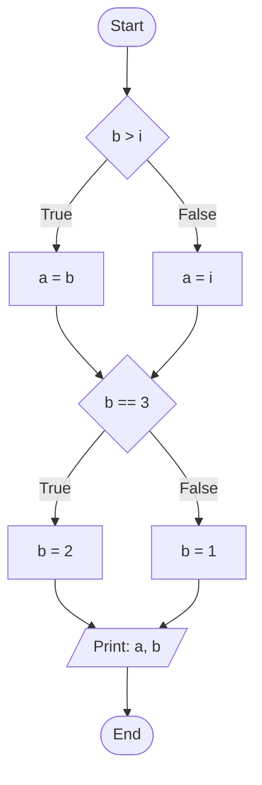

# {{ $slidev.configs.subject }}
## Lecture 3: Sequential and Conditional Program Flow

Presented by {{ $slidev.configs.presenter }}

Semester {{ $slidev.configs.semester }}

---

## Lecture Outline

1.  **C Program Anatomy**
2.  Sequential Program Execution
3.  Conditional Execution (`if-else`)
    * Relational & Equality Operators
    * Logical Operators
4. Nested `if-else`
    * `if-else if-else` ladder
    * `switch` statement
5.  Visualizing Logic with Flowcharts

---
layout: two-cols
---

## C Program Anatomy

A C program is built from a few key components, following a standard structure.

**Basic Structure:**

<div style="padding-right:50px">

```c
// 1. Preprocessor Directives
#include <stdio.h>

// 2. The main() Function
int main() {
    // 3. Variable Declarations
    int score = 100; // A statement

    // 4. Program Logic (Statements)
    printf("Score is: %d\n", score);

    // 5. Return Statement
    return 0;
}
```

</div>


::right::

**Core Components:**
*   **`#include <stdio.h>`**: A **preprocessor directive** that includes standard library definitions (like `printf`).
*   **`int main() { ... }`**: The mandatory **main function** where program execution begins.
*   **Statements**: Instructions like `variable = value;` or `printf(...)`. Each ends with a semicolon **`;`**.
*   **Comments**: Explanations ignored by the compiler, written as `// single-line` or `/* multi-line */`.
*   **`return 0;`**: Exits the `main` function, signaling success.


---

## Lecture Outline

1.  C Program Anatomy
2.  **Sequential Program Execution**
3.  Conditional Execution (`if-else`)
    * Relational & Equality Operators
    * Logical Operators
4. Nested `if-else`
    * `if-else if-else` ladder
    * `switch` statement
5.  Visualizing Logic with Flowcharts

---
layout: two-cols
---

## Sequential Control Flow

* By default, C programs execute statements one after another, in the order they appear in the code, from top to bottom within a block (`{}`).
* This straightforward, step-by-step execution is called **sequential control**.

```c
#include <stdio.h>

int main() {
    printf("Step 1\n"); // This runs first
    printf("Step 2\n"); // This runs second
    printf("Step 3\n"); // This runs third
    return 0;
}
```

:: right ::

<div style="padding-left:150px">


</div>


---
layout: two-cols
---

## Example: Swapping Two Variables (Sequential)

**Problem:** Swap the values stored in two integer variables, `a` and `b`.

**Incorrect Approach:**
```c
int a = 3, b = 5;
a = b; // Now a is 5
b = a; // Now b is also 5 (original value of a is lost!)
```

**Correct Approach (Using a temporary variable):**
```c {*}{lines:true, maxHeight:'150px'}
#include <stdio.h>

int main() {
    int a = 3, b = 5;
    int temp; // Temporary storage

    printf("Before swap: a = %d, b = %d\n", a, b);

    // Swap logic
    temp = a; // Store original value of a in temp (temp = 3)
    a = b;    // Assign value of b to a (a = 5)
    b = temp; // Assign original value of a (from temp) to b (b = 3)

    printf("After swap: a = %d, b = %d\n", a, b);
    return 0;
}
```
:: right ::

*Output:*
```text
Before swap: a = 3, b = 5
After swap: a = 5, b = 3
```

<div style="padding-left:150px">


</div>


---
layout: two-cols
---

## Example: Calculating Circle Area (Sequential)

**Problem:** Calculate the area of a circle given its radius. Formula: Area = π * r²

```c {*}{lines:true, maxHeight:'300px'}
#include <stdio.h>

int main() {
    // Define PI as a constant
    const float PI = 3.14159;
    float radius;
    float area;

    // Get radius from user
    printf("Enter the radius of the circle: ");
    scanf("%f", &radius);

    // Calculate area (sequential steps)
    area = PI * radius * radius;

    // Display the result
    printf("The area of the circle is: %f\n", area);

    return 0;
}
```
:: right ::

*This program follows a sequence: define constants/variables, get input, calculate, display output.*


<div style="padding-left:150px">


</div>

        


---
layout: two-cols
---

## Example: Fahrenheit to Celsius (Sequential)

**Problem:** Convert a temperature from Fahrenheit to Celsius. Formula: C = (F - 32) * 5 / 9

```c
#include <stdio.h>

int main() {
    float fahrenheit, celsius;

    // Get Fahrenheit temperature from user
    printf("Enter temperature in Fahrenheit: ");
    scanf("%f", &fahrenheit);

    // Perform conversion calculation
    // Note: Using 5.0/9.0 ensures floating-point division
    celsius = (fahrenheit - 32.0) * 5.0 / 9.0;

    // Display the Celsius temperature
    printf("Temperature in Celsius: %.2f\n", celsius); // %.2f formats to 2 decimal places

    return 0;
}
```


::right::

*Again, the steps are executed in order: get input, calculate, display output.*


<div style="padding-left:150px">


</div>


---

## Lecture Outline

1.  C Program Anatomy
2.  Sequential Program Execution
3.  **Conditional Execution (`if-else`)**
    * Relational & Equality Operators
    * Logical Operators
4. Nested `if-else`
    * `if-else if-else` ladder
    * `switch` statement
5.  Visualizing Logic with Flowcharts

---
layout: image-right
image: conditional_flow.png
---

## Conditional Control Flow

* Sequential execution isn't always sufficient. Often, programs need to make **decisions** based on certain conditions.
* We need the ability to execute different blocks of code depending on whether a condition is true or false.
* This is achieved using **conditional control** statements.

---
layout: two-cols
---


## The `if` Clause

* Executes a block of code **only if** a specified condition is true (evaluates to non-zero).
* **Syntax:**
    ```c
    if (condition) {
        // Statements to execute if condition is true
        statement1;
        statement2;
        // ...
    }
    // Execution continues here regardless of the condition
    ```
* The `condition` is typically an expression that results in a true (non-zero) or false (zero) value, often using relational operators (`>`, `<`, `==`, etc.).
* If the condition is false (0), the entire block within the `{}` is skipped.


:: right ::

* Curly braces `{}` are technically optional if there's only one statement inside, but using them is **highly recommended** for clarity and avoiding errors.

  *flow chart:*

<div style="padding-left:100px">


</div>


---
layout: two-cols
---

## Simple `if` Example

**Problem:** Print a message only if a number is positive.

<Transform scale="0.85">

```c
#include <stdio.h>

int main() {
    int number;

    printf("Enter an integer: ");
    scanf("%d", &number);

    // Check if the number is greater than 0
    if (number > 0) {
        // This block executes only if number > 0 is true
        printf("The number %d is positive.\n", number);
    }

    printf("End of program.\n"); // This always executes
    return 0;
}
```

*Output (if user enters 5):*
```text
Enter an integer: 5
The number 5 is positive.
End of program.
```

</Transform>


:: right ::
<div style="padding-left:10px">

*Output (if user enters -3):*
```text
Enter an integer: -3
End of program.
```
</div>
<div style="padding-left:120px">


</div>

---
layout: two-cols
---

## The `if-else` Clause

* Executes one block of code if a condition is true, and a *different* block if the condition is false.
* **Syntax:**
    ```c
    if (condition) {
        // Block 1: Executes if condition is true
        statementA1;
        statementA2;
    } else {
        // Block 2: Executes if condition is false
        statementB1;
        statementB2;
    }
    // Execution continues here after either Block 1 or Block 2 runs
    ```
* Exactly one of the two blocks (the `if` block or the `else` block) will be executed.

:: right ::

<div style="padding-left:50px">

*flow chart:*

</div>
<div style="padding-left:100px">


</div>


---
layout: two-cols
---


## `if-else` Example

**Problem:** Determine if a number is even or odd.

```c
#include <stdio.h>

int main() {
    int number;

    printf("Enter an integer: ");
    scanf("%d", &number);

    // Check if the remainder when divided by 2 is 0
    if (number % 2 == 0) {
        // Condition is true: Number is even
        printf("%d is an even number.\n", number);
    } else {
        // Condition is false: Number is odd
        printf("%d is an odd number.\n", number);
    }

    return 0;
}
```

:: right ::

<div style="padding-left:30px">

<Transform scale="1">

*Output (if user enters 4):*
```text
4 is an even number.
```

*Output (if user enters 7):*
```text
7 is an odd number.
```
</Transform>
</div>

<div style="padding-left:50px">


</div>


---

## The Conditional (Ternary) Operator

<Transform scale="0.9">

* Syntax: `condition ? expression_if_true : expression_if_false`
* A shorthand way to express a simple if-else choice within an expression.
* It takes three operands:
    1.  `condition`: An expression evaluated as true (non-zero) or false (zero).
    2.  `expression_if_true`: The value the entire ternary expression takes if `condition` is true.
    3.  `expression_if_false`: The value the entire ternary expression takes if `condition` is false.

**Example:** Find the maximum of `b` and `i`.
```c
int main() {
  int a, b = 3, i = 4;

  // If (b > i) is true, a = b. Otherwise, a = i.
  a = (b > i) ? b : i; // (3 > 4) is false, so a gets the value of i (4).

  // If (b == 3) is true, set b to 2. Otherwise, set b to 1.
  b = (b == 3) ? 2 : 1; // (3 == 3) is true, so b gets the value 2.

  printf("Result: a = %d, b = %d\n", a, b);
}
```

</Transform>

<div style="position:fixed;bottom:130px;right:150px;padding-bottom:30px">

**Output:**
```text
Result: a = 4, b = 2
```

</div>

<div style="position:fixed;bottom:50px;right:10px;padding-bottom:30px">


</div>

---

## Lecture Outline

1.  C Program Anatomy
2.  Sequential Program Execution
3.  Conditional Execution (`if-else`)
    * **Relational & Equality Operators**
    * Logical Operators
4. Nested `if-else`
    * `if-else if-else` ladder
    * `switch` statement
5.  Visualizing Logic with Flowcharts

---

## Conditions: Relational Operators

* Used to compare two values. Result is `1` (true) or `0` (false).

| Operator | Meaning                  | Example (`a=5`, `b=3`) | Result |
| :------- | :----------------------- | :--------------------- | :----- |
| `>`      | Greater than             | `a > b` (5 > 3)        | `1`    |
| `<`      | Less than                | `a < b` (5 < 3)        | `0`    |
| `>=`     | Greater than or equal to | `a >= 5` (5 >= 5)      | `1`    |
| `<=`     | Less than or equal to    | `b <= 2` (3 <= 2)      | `0`    |

---

## Conditions: Equality Operators

* Used to check if two values are equal or not equal. Result is `1` (true) or `0` (false).

| Operator | Meaning       | Example (`a=5`, `b=3`, `c=5`) | Result |
| :------- | :------------ | :---------------------------- | :----- |
| `==`     | Equal to      | `a == c` (5 == 5)             | `1`    |
| `!=`     | Not equal to  | `a != b` (5 != 3)             | `1`    |
| `==`     | Equal to      | `a == b` (5 == 3)             | `0`    |
| `!=`     | Not equal to  | `a != c` (5 != 5)             | `0`    |

**Common Mistake:** Using single `=` (assignment) instead of double `==` (equality comparison) in conditions. `if (a = 5)` assigns 5 to `a` and the condition becomes `if (5)`, which is always true! Use `if (a == 5)`.

---

## Lecture Outline

1.  C Program Anatomy
2.  Sequential Program Execution
3.  Conditional Execution (`if-else`)
    * Relational & Equality Operators
    * **Logical Operators**
4. Nested `if-else`
    * `if-else if-else` ladder
    * `switch` statement
5.  Visualizing Logic with Flowcharts

---

## Conditions: Logical Operators

* Used to combine or modify true/false conditions. Operate on values treated as true (non-zero) or false (zero). Result is `1` (true) or `0` (false).

| Operator | Meaning     | Example (`a=1`, `b=0`) | Result |
| :------- | :---------- | :--------------------- | :----- |
| `&&`     | Logical AND | `a && a` (T && T)      | `1`    |
| `&&`     | Logical AND | `a && b` (T && F)      | `0`    |
| `&&`     | Logical AND | `b && b` (F && F)      | `0`    |
| &#124;&#124;     | Logical OR  | `a` &#124;&#124; `a` (T &#124;&#124; T)      | `1`    |
| &#124;&#124;     | Logical OR  | `a` &#124;&#124; `b` (T &#124;&#124; F)      | `1`    |
| &#124;&#124;     | Logical OR  | `b` &#124;&#124; `b` (F &#124;&#124; F)      | `0`    |
---

| Operator | Meaning     | Example (`a=1`, `b=0`) | Result |
| :------- | :---------- | :--------------------- | :----- |
| `!`      | Logical NOT | `!a` (!T)              | `0`    |
| `!`      | Logical NOT | `!b` (!F)              | `1`    |

---

## Logical AND (`&&`)

* `condition1 && condition2` is true (`1`) **only if both** `condition1` and `condition2` are true (non-zero).
* **Short-circuiting:** If `condition1` evaluates to false (`0`), `condition2` is **not evaluated** because the overall result must be false.

**Truth Table:**

| condition1 | condition2 | `condition1 && condition2` |
| :--------- | :--------- | :------------------------- |
| False (0)  | False (0)  | False (0)                  |
| False (0)  | True (!=0) | False (0)                  |
| True (!=0) | False (0)  | False (0)                  |
| True (!=0) | True (!=0) | True (1)                   |

---

## Logical OR (`||`)

* `condition1 || condition2` is true (`1`) **if at least one** of `condition1` or `condition2` is true (non-zero).
* **Short-circuiting:** If `condition1` evaluates to true (`1`), `condition2` is **not evaluated** because the overall result must be true.

**Truth Table:**

| condition1 | condition2 | `condition1` &#124;&#124; `condition2` |
| :--------- | :--------- | :------------------------- |
| False (0)  | False (0)  | False (0)                  |
| False (0)  | True (!=0) | True (1)                   |
| True (!=0) | False (0)  | True (1)                   |
| True (!=0) | True (!=0) | True (1)                   |

---

## Logical NOT (`!`)

* `!condition` reverses the logical value of `condition`.
* If `condition` is true (non-zero), `!condition` is false (`0`).
* If `condition` is false (`0`), `!condition` is true (`1`).

**Truth Table:**

| condition  | `!condition` |
| :--------- | :----------- |
| False (0)  | True (1)     |
| True (!=0) | False (0)    |

---

## Operator Precedence (Including Logical)

Logical operators have lower precedence than relational/equality operators, which have lower precedence than arithmetic operators. `!` has higher precedence than `&&` and `||`. `&&` has higher precedence than `||`.

**Simplified Order (Highest to Lowest):**

1.  `!` (Logical NOT), `++`, `--` (Unary operators)
2.  `*`, `/`, `%` (Multiplicative)
3.  `+`, `-` (Additive)
4.  `<`, `<=`, `>`, `>=` (Relational)
5.  `==`, `!=` (Equality)
6.  `&&` (Logical AND)
7.  `||` (Logical OR)
8.  `=` (Assignment operators)

*Use parentheses `()` to clarify or override precedence.*
Example: `a > b && c < d` is evaluated as `(a > b) && (c < d)`.


---
layout: two-cols-header
---


## Combining Operators Example

:: left ::

**Problem:** Check if a number `x` is within the range [0, 10] (inclusive).

```c
int x = 5;
// Condition: x >= 0 AND x <= 10
if (x >= 0 && x <= 10) {
    printf("x is in the range [0, 10]\n");
} else {
    printf("x is outside the range [0, 10]\n");
}
```

:: right ::

The condition `x >= 0 && x <= 10` requires a number to be in two ranges simultaneously.

<div class="text-sm" style="padding-left:20px">

```text
Condition 1: x >= 0
... ------|-----------|-----------|------ ...
         -1           0           1
                      [------------------>
                      (true region)

Condition 2: x <= 10
... ------|-----------|-----------|------ ...
          9          10          11
<--------------------]
     (true region)

Combined View (AND)
... ------|-----------| ... |-----------|------ ...
         -1           0    10          11
                      [=====]
                  (final true region)
```

</div>
---

## Combining Operators Example (cont.)


**Problem:** Check if a character `ch` is NOT a vowel (uppercase or lowercase).

```c
char ch = 'b';
if (!(ch == 'a' || ch == 'e' || ch == 'i' || ch == 'o' || ch == 'u' ||
      ch == 'A' || ch == 'E' || ch == 'I' || ch == 'O' || ch == 'U')) {
    printf("%c is not a vowel.\n", ch);
} else {
    printf("%c is a vowel.\n", ch);
}
```

*(Alternatively, check if it IS a vowel and use the else block)*

---


## Common Mistake: `=` vs `==`

* Assignment (`=`): Stores a value in a variable. The expression itself evaluates to the value assigned.
* Equality (`==`): Compares two values. Evaluates to `1` (true) or `0` (false).

```c
int a = 0;

// Incorrect: Assignment used in condition
if (a = 5) { // Assigns 5 to 'a'. Condition becomes 'if (5)', which is TRUE.
    printf("This will always print if a = 5 is used!\n");
}

// Correct: Equality comparison used in condition
if (a == 5) { // Compares current value of 'a' with 5.
    printf("This prints only if a was already 5.\n");
}
```

*This is a frequent bug! Always double-check `=` vs `==` inside conditions.*

---

## Lecture Outline

1.  C Program Anatomy
2.  Sequential Program Execution
3.  Conditional Execution (`if-else`)
    * Relational & Equality Operators
    * Logical Operators
4. **Nested `if-else`**
    * `if-else if-else` ladder
    * `switch` statement
5.  Visualizing Logic with Flowcharts

---
layout: two-cols
---

## Nested `if-else` Clauses

<Transform scale="0.75">


* You can place `if` or `if-else` statements inside the blocks of other `if` or `else` statements. This allows for more complex decision-making structures.

**Syntax Example:**
```c
if (condition1) {
    // Code for condition1 being true
    if (condition2) {
        // Code for condition1 AND condition2 being true
    } else {
        // Code for condition1 true BUT condition2 false
    }
} else {
    // Code for condition1 being false
    if (condition3) {
        // Code for condition1 false BUT condition3 true
    } else {
        // Code for condition1 false AND condition3 false
    }
}
```

* Indentation is crucial for readability but doesn't affect the logic. The `else` always pairs with the nearest unmatched `if` unless braces `{}` dictate otherwise.

</Transform>


::right::


---
layout: two-cols-header
---

## Nested `if-else` Example: Max of Three

**Problem:** Find the largest of three numbers: `a`, `b`, `c`.

:: left ::

```c {*}{lines:true, maxHeight:'360px'}
#include <stdio.h>

int main() {
    int a = 10, b = 25, c = 15;
    int max;

    if (a > b) {
        // a is potentially the max (a > b)
        if (a > c) {
            max = a; // a > b and a > c
        } else {
            max = c; // c >= a and a > b => c is max
        }
    } else {
        // b is potentially the max (b >= a)
        if (b > c) {
            max = b; // b >= a and b > c
        } else {
            max = c; // c >= b and b >= a => c is max
        }
    }

    printf("The maximum value is: %d\n", max); // Output: 25
    return 0;
}
```

::right::

<div style="padding-left:50px;padding-top:0px">


</div>


---

## Lecture Outline

1.  C Program Anatomy
2.  Sequential Program Execution
3.  Conditional Execution (`if-else`)
    * Relational & Equality Operators
    * Logical Operators
4. Nested `if-else`
    * **`if-else if-else` ladder**
    * `switch` statement
5.  Visualizing Logic with Flowcharts

---
layout: two-cols
---

## The `if-else if-else` Ladder

* A common pattern for checking multiple mutually exclusive conditions in sequence.

**Syntax:**
```c
if (condition1) {
    // Block 1: Executes if condition1 is true
} else if (condition2) {
    // Block 2: Executes if condition1 false AND condition2 true
} else if (condition3) {
    // Block 3: Executes if cond1/cond2 false AND condition3 true
} // ... potentially more else if blocks
else {
    // Optional Final Else Block:
    // Executes if ALL preceding conditions were false
}
```

* Only one block in the entire ladder will be executed.

::right::

<div style="padding-left:100px">


</div>


---
layout: two-cols
---

## `if-else if-else` Ladder Example: Grading

**Problem:** Assign a letter grade based on a score.

```c {*}{maxHeight:'340px', lines:true}
#include <stdio.h>

int main() {
    int score = 75;
    char grade;

    if (score >= 90) {
        grade = 'A';
    } else if (score >= 80) { // Only checked if score < 90
        grade = 'B';
    } else if (score >= 70) { // Only checked if score < 80
        grade = 'C';
    } else if (score >= 60) { // Only checked if score < 70
        grade = 'D';
    } else { // Only runs if score < 60
        grade = 'F';
    }

    printf("Score: %d, Grade: %c\n", score, grade); // Output: Score: 75, Grade: C
    return 0;
}
```

::right::

<div style="padding-left:50px; padding-top:0px">


</div>

---

## Lecture Outline

1.  C Program Anatomy
2.  Sequential Program Execution
3.  Conditional Execution (`if-else`)
    * Relational & Equality Operators
    * Logical Operators
4. Nested `if-else`
    * `if-else if-else` ladder
    * **`switch` statement**
5.  Visualizing Logic with Flowcharts


---
layout: two-cols
---

## The `switch` Statement

* Provides an alternative way to select one code path from many, based on the value of an **integer** or **character** expression.
* Often clearer than long `if-else if` ladders when checking against multiple specific constant values.
* **Syntax:**
    ```c
    switch (expression) { // expression must evaluate to integer/char
        case constant_value_1:
            // Statements for case 1
            break; // IMPORTANT: Exits the switch
        case constant_value_2:
            // Statements for case 2
            break; // Exits the switch
        // ... more cases
        default: // Optional
            // Statements if no case matches
            break; // Optional but good practice
    }
    ```

::right::

<div style="padding-left:10px;padding-top:100px">


</div>
---

## `switch` Statement Details 

* `expression`: The integer or character value to be checked.
* `case constant_value:`: Defines a label. The code following this label executes *if* `expression` matches `constant_value`. The value must be a constant known at compile time (literal like `1`, `'A'`, or a `const` variable).
* `break;`: **Crucial!** This statement causes execution to jump out of the `switch` block.
* **Fall-through:** If you **omit** `break`, execution will continue ("fall through") into the statements of the *next* `case` label below it. This is sometimes intentional but often a bug if forgotten.
* `default:`: An optional label. The code here executes if *none* of the other `case` values match the `expression`.


---
layout: two-cols-header
---

## `switch` Example: Month Names


**Problem:** Print the name of the month based on its number (1-12).

:: left ::

<Transform scale="0.8">

```c {*}{lines:true}
#include <stdio.h>

int main() {
    int month_num = 3;

    switch (month_num) {
        case 1: printf("January\n"); break;
        case 2: printf("February\n"); break;
        case 3: printf("March\n"); break; // This case matches
        case 4: printf("April\n"); break;
        case 5: printf("May\n"); break;
        case 6: printf("June\n"); break;
        case 7: printf("July\n"); break;
        case 8: printf("August\n"); break;
        case 9: printf("September\n"); break;
        case 10: printf("October\n"); break;
        case 11: printf("November\n"); break;
        case 12: printf("December\n"); break;
        default: printf("Invalid month number\n"); break; // Handles numbers outside 1-12
    }
    // Output: March
    return 0;
}
```


</Transform>

::right::

<div style="padding-left:100px;position:fixed;right:0">


</div>


---

## `switch` vs `if-else if` 

* Use `switch` when:
    * You are checking a single integer or character variable/expression against multiple **constant** values.
    * It often results in cleaner code than a long `if-else if` chain for this specific scenario.
* Use `if-else if` when:
    * You need to check complex conditions involving ranges (e.g., `score >= 90`).
    * You are comparing non-integer types (like floats, though direct equality check for floats is often problematic).
    * The conditions are not based on simple equality with constants.
---
src: ./flow_chart_selection.md
---
---
layout: default
---

## Summary
<Transform scale="0.85">

*   **Program Structure:** C programs consist of preprocessor directives (`#include`), a `main` function, variables, statements (ending in `;`), and comments (`//` or `/* ... */`).
*   **Sequential Flow:** By default, statements execute in order from top to bottom.
*   **Conditional Flow (`if-else`):**
    *   `if (condition)` executes a block if the condition is true (non-zero).
    *   `if-else` provides an alternative block for when the condition is false.
    *   `if-else if-else` ladders check multiple, mutually exclusive conditions.
*   **Operators for Conditions:**
    *   **Relational:** `>` , `<`, `>=`, `<=`
    *   **Equality:** `==` (equal), `!=` (not equal). Avoid the common mistake of using `=` for comparison.
    *   **Logical:** `&&` (AND), `||` (OR), `!` (NOT), with short-circuiting behavior.
*   **`switch` Statement:**
    *   An efficient way to select a code path based on an integer or character value.
    *   Uses `case`, `break`, and an optional `default`.
*   **Flowcharts:** Visual diagrams for planning program logic using standard symbols to represent steps, decisions, and flow.

</Transform>

<div style="position:fixed;bottom:0;right:20px;padding-bottom:30px">
<Link to="lab3" title="Go to Lab3 👩‍🔬"/>
</div>
