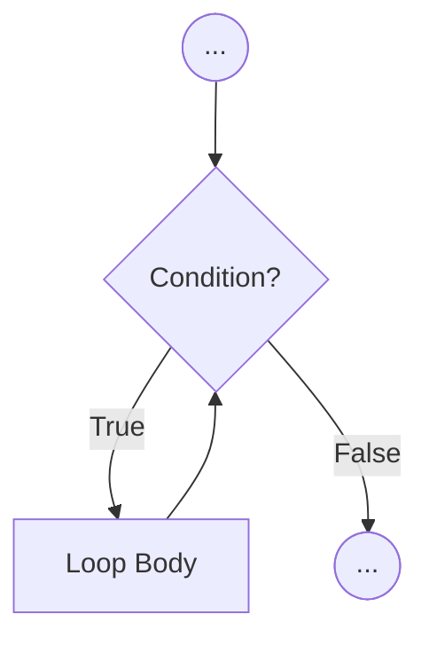
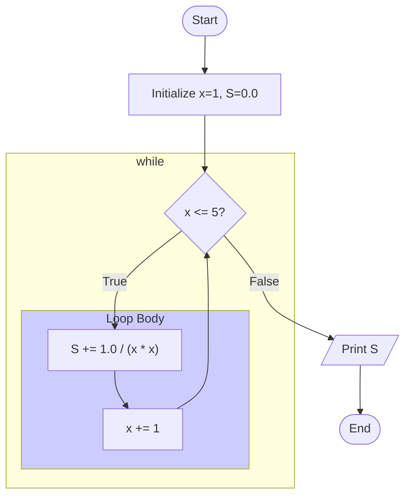
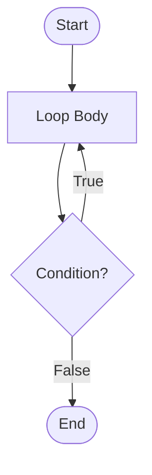
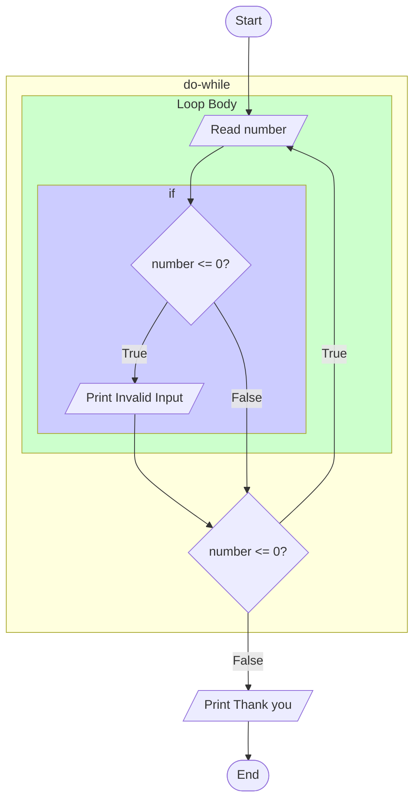
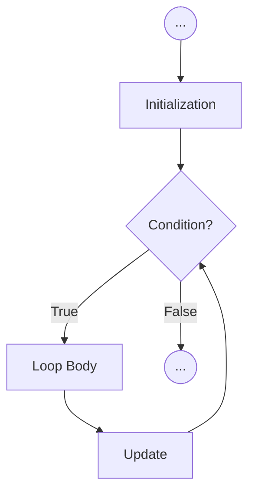
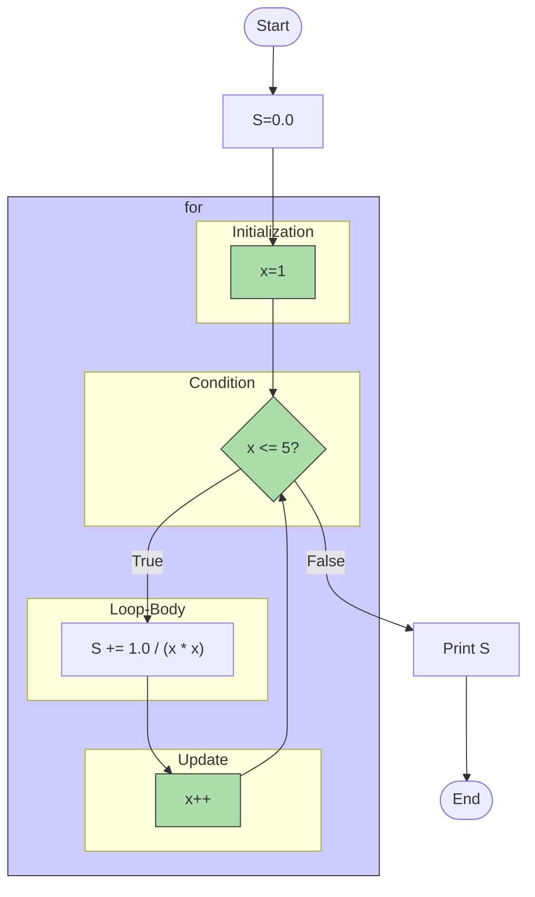
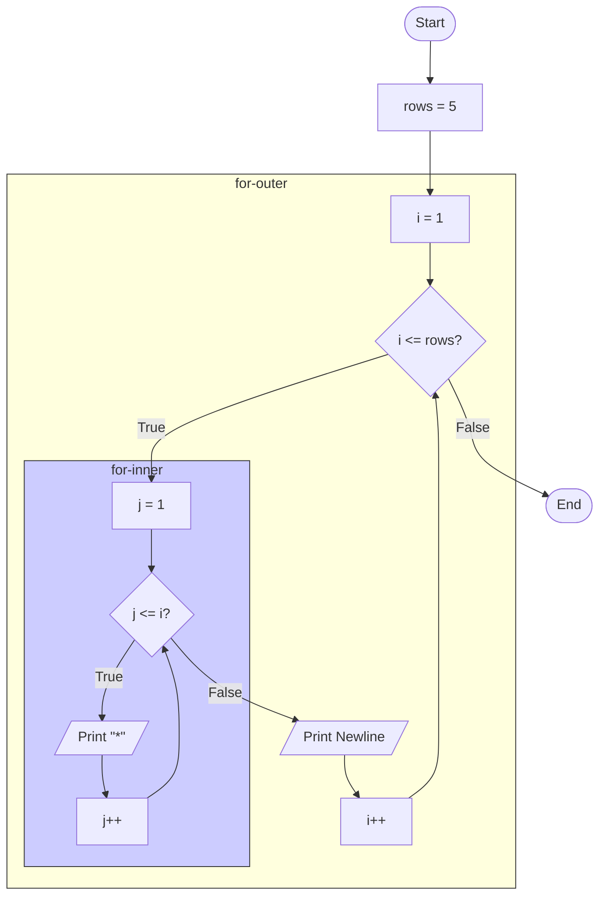
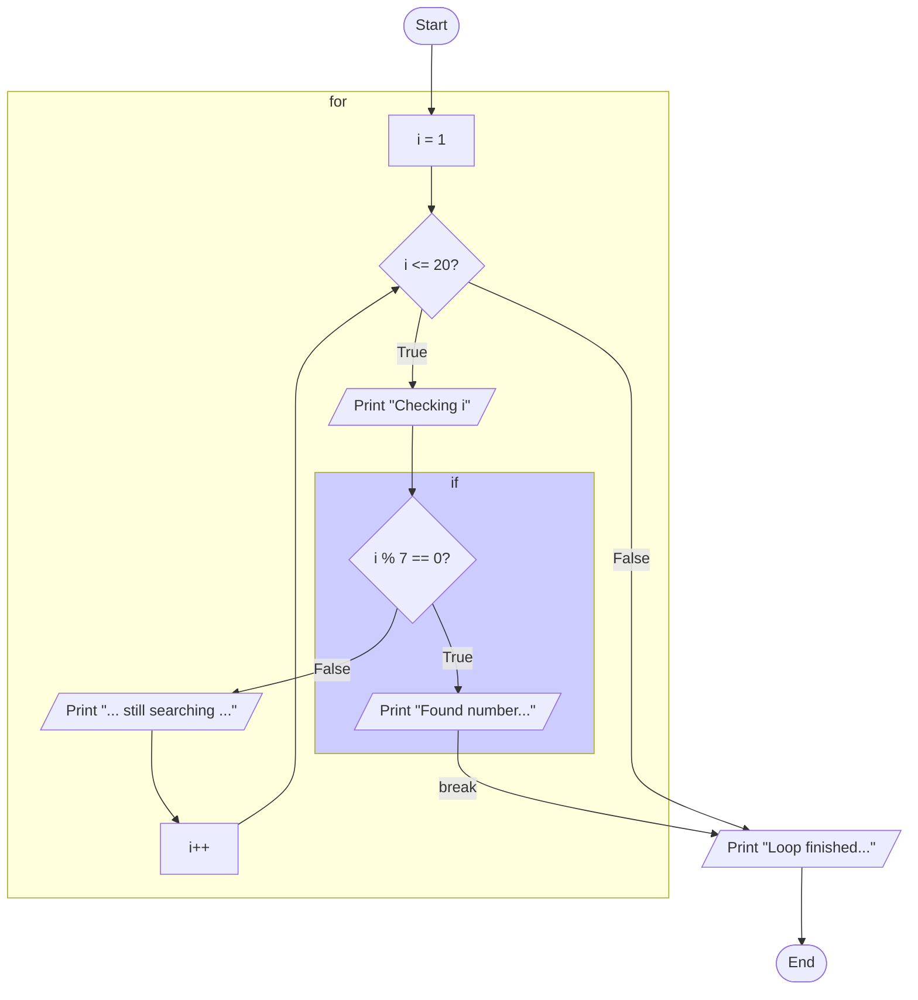
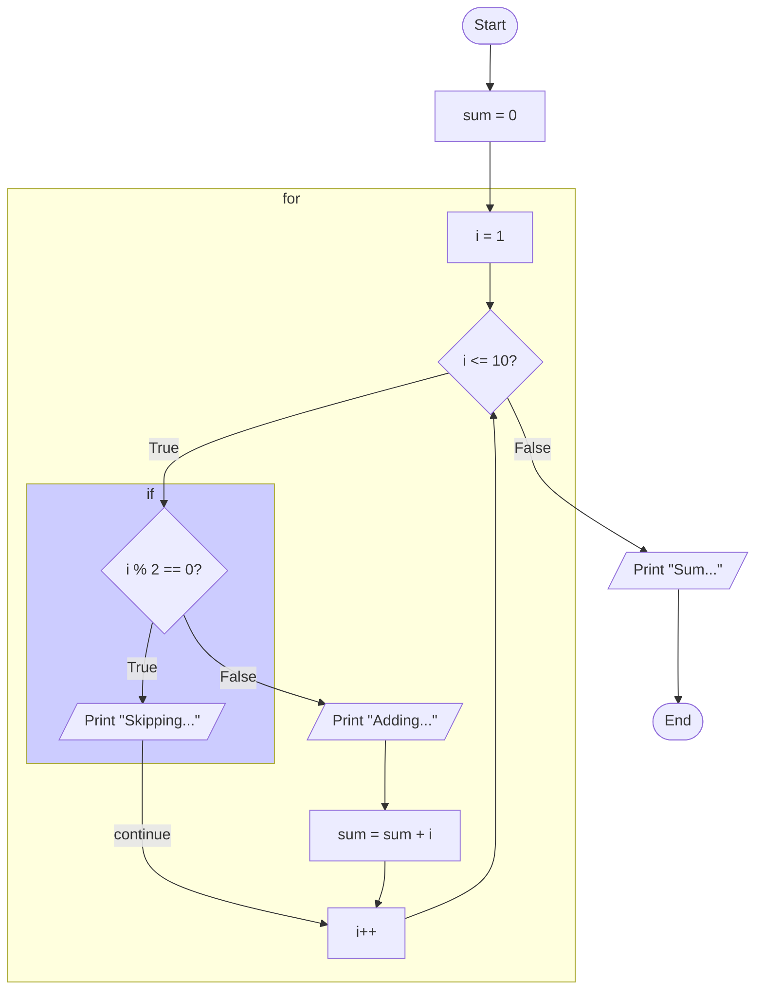

# Computer Programming
## Lecture 4: Loop Control Structures

Presented by {{ $slidev.configs.presenter }}

Semester {{ $slidev.configs.semester }}

---

## Lecture Outline

1.  **Looping Constructs**
    *   `while` Loop: Pre-test condition.
    *   `do-while` Loop: Post-test condition.
    *   `for` Loop: Initialization, condition, and update.
2.  Loop Control Statements
    *   `break`: Terminating a loop.
    *   `continue`: Skipping an iteration.
3.  Introduction to Debugging
    *   Using `printf` for tracing.
    *   Debugger Tools & Common Bugs.
4.  Visualizing Logic with Flowcharts for Loops

---
layout: two-cols-header
---

## Motivation: Repetitive Calculation
<br>
<br>

* **Problem:** Calculate the sum $S = \sum_{x=1}^{5} \frac{1}{x^2}$ (i.e., $1/1^2 + 1/2^2 + 1/3^2 + 1/4^2 + 1/5^2$).


::right::

<div style="padding-left:50px">

```c {*}
int main() {
    int x = 1;
    double S = 0.0;

    S += 1.0 / (x * x); // x=1
    x += 1;
    S += 1.0 / (x * x); // x=2
    x += 1;
    S += 1.0 / (x * x); // x=3
    x += 1;
    S += 1.0 / (x * x); // x=4
    x += 1;
    S += 1.0 / (x * x); // x=5

    printf("S = %f\n", S);
    return 0;
}
```

</div>


::left::

* **Using only sequential code (as learned so far):**
* This approach is manageable for a small number of terms (like 5).
* **Challenge:** What if we needed to calculate the sum for 1000 terms? Writing the code sequentially becomes extremely tedious and impractical. We need a way to handle repetition efficiently.

---

## Lecture Outline

1.  **Understanding Loops**
    *   `while` Loop: Pre-test condition.
    *   `do-while` Loop: Post-test condition.
    *   `for` Loop: Initialization, condition, and update.
2.  Loop Control Statements
    *   `break`: Terminating a loop.
    *   `continue`: Skipping an iteration.
3.  Introduction to Debugging
4.  Visualizing Logic with Flowcharts for Loops

---

## Introduction to Loops

* Loops are fundamental control structures used to execute a block of code **repeatedly** as long as a certain condition remains true.
* They automate repetitive tasks, making code more concise and manageable.
* **Key Components of a Loop:**
    1.  **Initialization:** Setting up variables before the loop starts (e.g., initializing a counter).
    2.  **Condition:** An expression checked before (or sometimes after) each repetition. If true, the loop continues; if false, the loop terminates.
    3.  **Update:** Modifying variables within the loop, often to eventually make the condition false (e.g., incrementing a counter).
    4.  **Loop Body:** The block of statements executed during each repetition.

---
layout: two-cols
---

## The `while` Loop

* Checks the condition **before** each iteration. If the condition is initially false, the loop body never executes.
* **Syntax:**
    ```c
    // Initialization (before the loop)
    while (condition) { // Condition checked here
        // Loop Body: Statements to repeat
        // ...
        // Update (usually inside the loop body)
    }
    // Execution continues here after the loop finishes
    ```
* **Logic:**
    1. Evaluate `condition`.
    2. If `condition` is true (non-zero), execute the loop body, then go back to step 1.
    3. If `condition` is false (zero), skip the loop body and continue execution after the loop.

::right::

<div style="padding-left:120px">



</div>

---
layout: two-cols
---


## `while` Loop Example: Sum Calculation

* **Problem:** Calculate $S = \sum_{x=1}^{5} \frac{1}{x^2}$ using a `while` loop.


```c {*}{maxHeight:'250px'}
#include <stdio.h>

int main() {
    int x;
    double S;

    // Initialization
    x = 1;
    S = 0.0;

    // Loop Condition
    while (x <= 5) {
        // Loop Body
        S += 1.0 / (x * x);

        // Update
        x += 1; // Increment x for the next iteration
    } // Go back to check condition (x <= 5)

    printf("S = %f\n", S);
    return 0;
}
```

* This code achieves the same result as the sequential version but is much more scalable for a larger number of terms.

::right::

<div style="padding-left:50px">


</div>

---
layout: two-cols
---

## The `do-while` Loop


* Executes the loop body **once before** checking the condition for the first time. Guarantees the loop body runs at least once.

<div style="padding-left:120px">



</div>

::right::

<Transform scale="0.9">

* **Syntax:**
    ```c
    // Initialization (before the loop)
    do {
        // Loop Body: Statements to repeat
        // ...
        // Update (usually inside the loop body)
    } while (condition); // Condition checked here, after the body runs
    // Execution continues here after the loop finishes
    ```
* Notice the semicolon `;` required after the `while (condition)`.


* **Logic:**
    1. Execute the loop body.
    2. Evaluate `condition`.
    3. If `condition` is true (non-zero), go back to step 1.
    4. If `condition` is false (zero), continue execution after the loop.
</Transform>


---
layout: two-cols-header
---

## `do-while` Loop Example: Input Validation

* **Problem:** Keep asking the user to enter a positive number until they comply.

::left::

```c
#include <stdio.h>

int main() {
    int number;

    do {
        // Loop body always executes at least once
        printf("Enter a positive integer: ");
        scanf("%d", &number);

        if (number <= 0) {
            printf("Invalid input. Please try again.\n");
        }
    } while (number <= 0); // Condition checked after input

    printf("Thank you! You entered: %d\n", number);
    return 0;
}
```

* The `do-while` loop is suitable here because we need to get the input *before* we can check if it's valid.

::right::

<div style="position:fixed;bottom:30px;right:20px">




</div>

---


## Comparing `while` and `do-while`

| **Feature**        | `while (condition) { ... }`        | `do { ... } while (condition);` |
| -------------- | ---------------------------------- | -------------------------------- |
| **Condition Check** | Before first iteration           | After first iteration            |
| **Guaranteed Exec?** | No (0 times if initially false) | Yes (at least 1 time)            |
| **Use Case** | General looping when 0 iterations is possible | Looping where at least one execution is always needed (e.g., menu display, initial input) |

---
layout: two-cols
---

## The `for` Loop

* Often used when the number of iterations is known or can be controlled by a counter. It conveniently combines initialization, condition checking, and update into one line.

* **Logic:**
    1. Execute `initialization` (only once, before the loop starts).
    2. Evaluate `condition`.
    3. If `condition` is true (non-zero):
        a. Execute the loop body.
        b. Execute `update`.
        c. Go back to step 2.
    4. If `condition` is false (zero), skip the loop body and continue execution after the loop.

::right::
* **Syntax:**
    ```c
    for (initialization; condition; update) {
        // Loop Body: Statements to repeat
    }
    // Execution continues here after the loop finishes
    ```

<div style="padding-left:120px">



</div>
---
layout: two-cols
---

## `for` Loop Example: Sum Calculation

* **Problem:** Calculate $S = \sum_{x=1}^{5} \frac{1}{x^2}$ using a `for` loop.
````md magic-move
```c {*|7-8|7-10|7-10,13-14}{lines: true,maxHeight:'300px'}
#include <stdio.h>

int main() {
    int x; // Loop counter
    double S = 0.0;

    // Initialization: x = 1
    x = 1;
    // Condition: x <= 5
    while ( x <= 5 ) {
        // Loop Body
        S += 1.0 / (x * x);
        // Update: x++ (increment x after each iteration)
        x++;
    }

    printf("S = %f\n", S);
    return 0;
}
```
```c {7-10|*}{lines: true,maxHeight:'300px'}
#include <stdio.h>

int main() {
    int x; // Loop counter
    double S = 0.0;

    // Initialization: x = 1
    // Condition: x <= 5
    // Update: x++ (increment x after each iteration)
    for (x = 1; x <= 5; x++) {
        // Loop Body
        S += 1.0 / (x * x);
    }

    printf("S = %f\n", S);
    return 0;
}
```
````

::right::
* This is often considered the most idiomatic way to write loops controlled by a simple counter.

<div style="padding-left:80px">



</div>

---


## Flexibility of the `for` Loop

* Any of the three parts (`initialization`, `condition`, `update`) can be omitted, though the semicolons `;` must remain.
    * Omitting `initialization`: If the variable is already initialized before the loop.
    * Omitting `condition`: Creates an infinite loop unless terminated by `break` or `return` inside the body (condition defaults to true).
    * Omitting `update`: The update must happen inside the loop body instead.
* You can have multiple initializations or updates, separated by commas `,`.

```c
// Example: Multiple initializations and updates
int i, j;
for (i = 0, j = 10; i < j; i++, j--) {
    printf("i=%d, j=%d\n", i, j);
}

// Example: Infinite loop (use with caution!)
// for (;;) {
//     printf("Looping forever...\n");
// }
```

---

## `for` Loop Example: Factorial

* **Problem:** Calculate factorial N (N! = 1 * 2 * ... * N).

```c
#include <stdio.h>

int main() {
    int n = 5; // Calculate 5!
    long long factorial = 1; // Use long long for potentially large results
    int i;

    if (n < 0) {
        printf("Factorial not defined for negative numbers.\n");
    } else {
        // Calculate factorial using a for loop
        for (i = 1; i <= n; i++) {
            factorial *= i; // factorial = factorial * i
        }
        printf("Factorial of %d (%d!) = %lld\n", n, n, factorial);
    }
    return 0;
}
// Output: Factorial of 5 (5!) = 120
```

---
layout: two-cols
---

## Nested Loops Example: Printing a Pattern

* Placing one loop inside another (nested loops) is common for working with 2D structures or creating patterns.

**Problem:** Print a right-angled triangle pattern of stars.

```c {*}{lines:true,maxHeight:'250px'}
#include <stdio.h>

int main() {
    int rows = 5;
    int i, j; // Outer loop counter (rows), Inner loop counter (columns)

    // Outer loop controls the number of rows
    for (i = 1; i <= rows; i++) {
        // Inner loop controls the number of stars in the current row
        for (j = 1; j <= i; j++) {
            printf("*");
        }
        // Move to the next line after printing stars for the current row
        printf("\n");
    }
    return 0;
}
```

::right::

<div style="padding-left:50px">



</div>

<div style="position:fixed;bottom:100px;right:50px">

```text{none|1|1-2|1-3|1-4|1-5}
*
**
***
****
*****
```

</div>


---

## Lecture Outline

1.  Looping Constructs
    *   `while` Loop: Pre-test condition.
    *   `do-while` Loop: Post-test condition.
    *   `for` Loop: Initialization, condition, and update.
2.  **Loop Control Statements**
    *   `break`: Terminating a loop.
    *   `continue`: Skipping an iteration.
3.  Introduction to Debugging
    *   Using `printf` for tracing.
    *   Debugger Tools & Common Bugs.
4.  Visualizing Logic with Flowcharts for Loops

---

## The `break` Statement

* Immediately **terminates** the execution of the innermost `switch` statement or loop (`while`, `do-while`, `for`) it is contained within.
* Execution resumes at the first statement *after* the terminated loop or switch.

**Syntax:**
```c
break;
```

---
layout: two-cols-header
---
## `break` Example: Finding First Number Divisible by 7

:: left ::
*Code:*
```c {*}
#include <stdio.h>

int main() {
    int i;

    for (i = 1; i <= 20; i++) {
        printf("Checking %d\n", i);
        if (i % 7 == 0) {
            printf("Found number divisible by 7: %d\n", i);
            break; // Exit the loop immediately
        }
        // This part is skipped after break
        printf("... still searching ...\n");
    }
    // Execution continues here after the break
    printf("Loop finished or exited via break.\n");
    return 0;
}
```
::right::

<div style="padding-left:30px">

*Output:*
```text
Checking 1
... still searching ...
Checking 2
... still searching ...
Checking 3
... still searching ...
Checking 4
... still searching ...
Checking 5
... still searching ...
Checking 6
... still searching ...
Checking 7
Found number divisible by 7: 7
Loop finished or exited via break.
```

</div>

---
layout: two-cols
---

## `break` Example: Finding First Number Divisible by 7

*Code:*
```c {*}
#include <stdio.h>

int main() {
    int i;

    for (i = 1; i <= 20; i++) {
        printf("Checking %d\n", i);
        if (i % 7 == 0) {
            printf("Found number divisible by 7: %d\n", i);
            break; // Exit the loop immediately
        }
        // This part is skipped after break
        printf("... still searching ...\n");
    }
    // Execution continues here after the break
    printf("Loop finished or exited via break.\n");
    return 0;
}
```
::right::




---

## The `continue` Statement

* Skips the **remainder of the current iteration** of the innermost loop (`while`, `do-while`, `for`) it is contained within.
* Execution jumps directly to the **next iteration's condition check** (for `while`, `do-while`) or the **update expression** (for `for` loops).
* Does **not** terminate the loop entirely (unlike `break`).

**Syntax:**
```c
continue;
```

---
layout: two-cols
---


## `continue` Example: Summing Only Odd Numbers

```c
#include <stdio.h>

int main() {
    int i;
    int sum = 0;

    for (i = 1; i <= 10; i++) {
        // Check if the number is even
        if (i % 2 == 0) {
            // If even, skip the rest of this iteration
            printf("Skipping even number %d\n", i);
            continue;
        }
        // This part only executes for odd numbers
        printf("Adding odd number %d\n", i);
        sum += i;
    } // continue jumps here for the next iteration (update i++)

    printf("Sum of odd numbers (1-10): %d\n", sum); // Output: 25 (1+3+5+7+9)
    return 0;
}
```

::right::



---

## Lecture Outline

1.  Looping Constructs
    *   `while` Loop: Pre-test condition.
    *   `do-while` Loop: Post-test condition.
    *   `for` Loop: Initialization, condition, and update.
2.  Loop Control Statements
    *   `break`: Terminating a loop.
    *   `continue`: Skipping an iteration.
3.  **Introduction to Debugging**
    *   Using `printf` for tracing.
    *   Debugger Tools & Common Bugs.
4.  Visualizing Logic with Flowcharts for Loops

---
layout: image-right
image: "/debug.png"
---


## What is Debugging? 

<br>

* 🐛 **Bug:** An error, flaw, or fault in a computer program that causes it to produce an incorrect or unexpected result, or to behave in unintended ways.
* 🔍 **Debugging:** The process of finding and resolving bugs within computer programs.
* It's a crucial skill for any programmer, as errors are common during development.

---

## Simple Debugging: Using `printf`

* A basic technique is to insert `printf` statements at various points in your code to print the values of variables or indicate which parts of the code are being executed.
* This helps you trace the program's flow and identify where things go wrong.

```c {*}{maxHeight:'300px'}
#include <stdio.h>

int main() {
    int x = 1, sum = 0, limit = 5;
    printf("DEBUG: Before loop: x=%d, sum=%d\n", x, sum); // Debug print

    while (x <= limit) {
        printf("DEBUG: Start of loop iteration: x=%d\n", x); // Debug print
        sum += x;
        printf("DEBUG: After adding x: sum=%d\n", sum); // Debug print
        x++;
        printf("DEBUG: After incrementing x: x=%d\n", x); // Debug print
    }

    printf("DEBUG: After loop: sum=%d\n", sum); // Debug print
    printf("Final Sum = %d\n", sum);
    return 0;
}
```

* **Pros:** Simple, works anywhere.
* **Cons:** Clutters code, need to remove prints later, tedious for complex issues.

---

## Using a Debugger Tool

* **Debugger:** A specialized tool that allows you to control the execution of your program step-by-step, inspect variable values, and analyze program state. Much more powerful than `printf` debugging.
* **Common Debugger Features:**
    * **Breakpoints:** Pause execution at specific lines of code.
    * **Watchpoints:** Monitor the values of specific variables.
    * **Step Over:** Execute the current line; if it's a function call, execute the whole function without stepping inside.
    * **Step Into:** Execute the current line; if it's a function call, jump into that function to debug it line-by-line.
    * **Step Out:** Continue execution until the current function returns.
    * **Call Stack:** Shows the sequence of function calls that led to the current execution point.

---

## Debuggers in IDEs

* Most IDEs (like Visual Studio, Dev-C++, Code::Blocks, VS Code with extensions) have built-in graphical debuggers that integrate these features.
* Learning to use your IDE's debugger is highly recommended for efficient bug finding.

* **Typical Workflow:**
    1. Set breakpoints at suspicious lines.
    2. Run the program in debug mode.
    3. Execution pauses at the breakpoint.
    4. Inspect variable values (using watch windows or hovering).
    5. Step through the code (Step Over, Step Into) to follow the logic.
    6. Identify where the program deviates from expected behavior.

---

## Common Types of Programming Errors (Bugs)

* **Syntax Errors:** Mistakes in using the language rules (e.g., missing semicolon `;`, misspelled keyword). The compiler catches these *before* the program runs. **These are not typically called "bugs" in the runtime sense.**
* **Logic Errors:** The code compiles and runs, but it doesn't do what you intended because the logic or algorithm is flawed (e.g., using `+` instead of `-`, incorrect loop condition, off-by-one errors). **These are the primary focus of debugging.**
* **Runtime Errors:** Errors that occur while the program is running (e.g., dividing by zero, trying to access invalid memory - often leading to crashes). Debuggers are essential for finding the cause.

---

## Logic Bug Examples in Loops

* **Misplaced Semicolon:** Accidentally placing a semicolon after a loop condition creates an empty loop body.

```c
int i = 0, s = 0;
// WRONG: Semicolon ends the for statement here!
for (i = 0; i < 5; i++); // Loop runs 5 times doing nothing
{ // This block executes only ONCE after the loop finishes
    s += i; // 'i' will be 5 here
} // 's' becomes 5, not 0+1+2+3+4=10
```

* **Incorrect Loop Condition/Update:** Leading to infinite loops or incorrect number of iterations.

```c
// Infinite loop if i starts non-positive
for (i = 0; i < 5; i--) { // Decrementing 'i' means condition i<5 is always true
    s += i;
}

// Misusing continue
if (i % 2 == 1); // Stray semicolon, condition has no effect
    continue;   // Continue might always execute or never execute depending on {}
```

* **Off-by-One Errors:** Loop runs one time too many or one time too few (e.g., using `<` instead of `<=`).

---

## Bug Classification Perspective

* Another way to think about bugs (especially in C):
    1.  **Non-Memory Related Bugs:** Logic errors that don't directly involve incorrect memory access (e.g., calculation errors, flawed algorithm logic).
    2.  **Memory Related Bugs:** Errors involving incorrect use of pointers, array bounds, memory allocation/deallocation (e.g., accessing freed memory, buffer overflows, null pointer dereferences). These are often harder to track down and can cause crashes or unpredictable behavior.

*Remember: Compiler errors (syntax mistakes) are not runtime bugs, they prevent the program from being created in the first place.*

---

## Lecture Outline

1.  Looping Constructs
    *   `while` Loop: Pre-test condition.
    *   `do-while` Loop: Post-test condition.
    *   `for` Loop: Initialization, condition, and update.
2.  Loop Control Statements
    *   `break`: Terminating a loop.
    *   `continue`: Skipping an iteration.
3.  Introduction to Debugging
    *   Using `printf` for tracing.
    *   Debugger Tools & Common Bugs.
4.  **Visualizing Logic with Flowcharts for Loops**


---
src: ./flow_chart_loop.md
---

---
layout: default
---

## Summary
<Transform scale="0.85">

*   **Loops for Repetition:** Loops (`while`, `do-while`, `for`) are essential for executing a block of code multiple times.
*   **`while` Loop:** A pre-test loop. The condition is checked *before* each iteration. It may run zero or more times.
*   **`do-while` Loop:** A post-test loop. The condition is checked *after* each iteration. It always runs at least once.
*   **`for` Loop:** Combines initialization, condition, and update in one line. Ideal for counter-controlled loops.
*   **Loop Control:**
    *   `break`: Immediately terminates the innermost loop or `switch` statement.
    *   `continue`: Skips the rest of the current iteration and proceeds to the next.
*   **Debugging:** The process of finding and fixing errors. Simple `printf` tracing is a basic technique, but using a debugger tool provides more powerful features like breakpoints and stepping through code.
*   **Flowcharts for Loops:** Visual diagrams that illustrate the repetition, condition, and exit points for `while`, `do-while`, and `for` loops.

</Transform>

<div style="position:fixed;bottom:0;right:20px;padding-bottom:30px">
<Link to="lab4" title="Go to Lab4 👩‍🔬"/>
</div>
