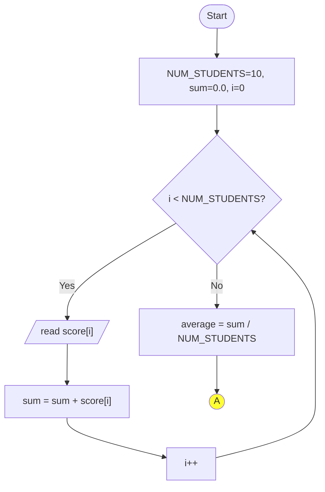
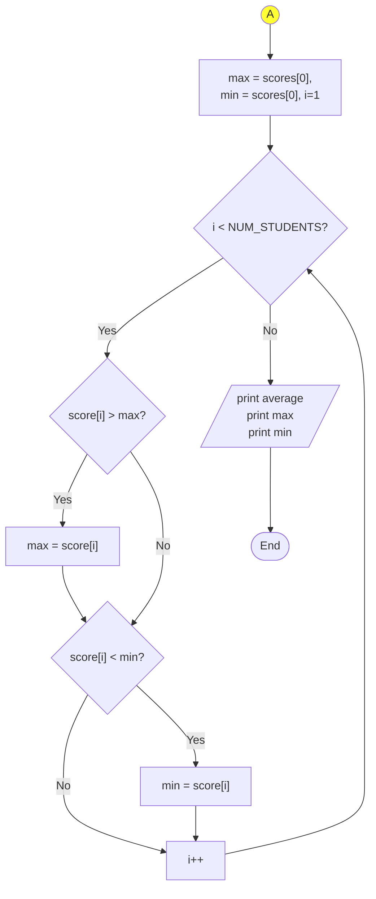

# Computer Programming
## Lecture 6: Arrays and Strings

Presented by {{ $slidev.configs.presenter }}

Semester {{ $slidev.configs.semester }}

---

## Lecture Outline

1.  **Arrays**
    *   One-Dimensional (1D) Arrays
        *   Declaration, Initialization & Access
        *   Passing to Functions (Pass-by-Reference)
        *   Bounds Checking & `sizeof`
    *   Two-Dimensional (2D) Arrays
        *   Declaration, Initialization & Access
        *   Memory Layout (Row-Major)
        *   Passing to Functions
2.  **Strings (as Character Arrays)**
    *   The Null-Terminated String (`\0`)
    *   Initialization & I/O (`scanf`/`printf`)
    *   Standard Library Functions (`<string.h>`)

---

## Motivating Example: Handling Multiple Data Items

* **Problem:** Consider needing to process the math scores for 10 students in a class. Tasks might include calculating the sum, average, max/min score, or ranking them.
* **Approach Using Only Simple Variables:** We would need to declare 10 separate `float` variables (e.g., `x1`, `x2`, ..., `x10`). Reading input and calculating the sum would involve repetitive code for each variable:
    ```c
    float x1, x2, ..., x10;
    float sum = 0.0;
    scanf("%f", &x1); sum += x1;
    scanf("%f", &x2); sum += x2;
    // ... repeat 10 times ...
    ```
* **Challenge:** This becomes extremely cumbersome if we have 100 or 1000 students. We need a more efficient way to store and process collections of similar data. This leads us to **Arrays**.

---

## Lecture Outline

1.  **Arrays**
    *   **One-Dimensional (1D) Arrays**
        *   **Declaration, Initialization & Access**
        *   **Passing to Functions (Pass-by-Reference)**
        *   **Bounds Checking & `sizeof`**
    *   Two-Dimensional (2D) Arrays
        *   Declaration, Initialization & Access
        *   Memory Layout (Row-Major)
        *   Passing to Functions
2.  **Strings (as Character Arrays)**
    *   The Null-Terminated String (`\0`)
    *   Initialization & I/O (`scanf`/`printf`)
    *   Standard Library Functions (`<string.h>`)

---

## Introduction to 1D Arrays

* An **array** is a data structure that stores a fixed-size, sequential collection of elements of the **same data type**.
* Think of it as a numbered list of variables stored together.
* **Declaration Syntax:**
    `data_type array_name[array_size];`
    * `data_type`: The type of elements the array will hold (e.g., `int`, `float`, `char`).
    * `array_name`: The identifier used to refer to the array.
    * `array_size`: A positive integer constant specifying the number of elements.
* **Memory:** Array elements are stored contiguously (one after another) in memory.
* **Indexing:** Individual elements are accessed using an **index** (or subscript), starting from **0** for the first element up to `array_size - 1` for the last element.

```c
// Declare an array named 'scores' that can hold 10 integers.
int scores[10]; // Elements are scores[0], scores[1], ..., scores[9]

// Declare an array named 'prices' that can hold 5 floating-point numbers.
float prices[5]; // Elements are prices[0], prices[1], ..., prices[4]
```

---

## Array Initialization

* You can initialize an array when you declare it using curly braces `{}`.
* **Methods:**
    1.  **Full Initialization:** Provide values for all elements.
        ```c
        int numbers[5] = {10, 20, 30, 40, 50};
        // numbers[0]=10, numbers[1]=20, ..., numbers[4]=50
        ```
    2.  **Partial Initialization:** Provide fewer values than the size. Remaining elements are automatically initialized to zero (for numeric types).
        ```c
        float rates[5] = {1.1, 2.2};
        // rates[0]=1.1, rates[1]=2.2, rates[2]=0.0, rates[3]=0.0, rates[4]=0.0
        ```
    3.  **Size Omission:** If initializing, you can omit the size; the compiler determines it from the number of initializers.
        ```c
        char vowels[] = {'a', 'e', 'i', 'o', 'u'};
        // Compiler creates an array of size 5.
        ```
    4.  **Designated Initializers (C99+):** Initialize specific elements by index.
        ```c
        int data[10] = {[2] = 99, [0] = 10, [5] = 55};
        // data[2]=99, data[0]=10, data[5]=55. Others are 0.
        ```

---

## Accessing Array Elements

* Use the array name followed by the index in square brackets `[]` to access or modify an element. Remember, indexing starts at 0.
* `array_name[index]`

```c {*}{maxHeight:'300px',lines:true}
#include <stdio.h>

int main() {
    int values[5]; // Declare an array of 5 integers

    // Assign values using index
    values[0] = 100; // First element
    values[1] = 110;
    values[2] = 120;
    values[3] = 130;
    values[4] = 140; // Last element

    // Access and print elements
    printf("First element: %d\n", values[0]);  // Output: 100
    printf("Third element: %d\n", values[2]);  // Output: 120

    // Modify an element
    values[2] = 999;
    printf("Modified third element: %d\n", values[2]); // Output: 999

    // Access using a variable index (common in loops)
    int i = 4;
    printf("Element at index %d: %d\n", i, values[i]); // Output: 140

    return 0;
}
```

---
layout: two-cols-header
---

## Example: Student Scores Revisited (Using Arrays)

:: left ::

*   This code is much cleaner and easily adaptable for 100 or 1000 students by just changing `NUM_STUDENTS`.

```c {*}{maxHeight: '330px', lines: 'true'}
#include <stdio.h>
#define NUM_STUDENTS 10

int main() {
    float scores[NUM_STUDENTS];
    float sum = 0.0, average, max, min;
    int i;

    // Input scores using a loop
    printf("Enter %d scores:\n", NUM_STUDENTS);
    for (i = 0; i < NUM_STUDENTS; i++) {
        scanf("%f", &scores[i]);
        sum += scores[i];
    }

    // Calculate average
    average = sum / NUM_STUDENTS;

    // Find max and min scores
    max = min = scores[0];
    for (i = 1; i < NUM_STUDENTS; i++) {
        if (scores[i] > max) max = scores[i];
        if (scores[i] < min) min = scores[i];
    }

    // Output results
    printf("Average: %.2f\n", average);
    printf("Max: %.2f, Min: %.2f\n", max, min);
    return 0;
}
```

:: right ::



<div style="top:20px;right:10px;position:absolute">

</div>


---

## Example: Frequency Counting

* Another common task is to count how many times each element appears in an array.
* A simple way to do this for integer arrays with a known, limited range of values is to use a second "frequency" array.
* The index of the frequency array corresponds to a value in the original array.

```c {*}{maxHeight:'300px',lines:true}
#include <stdio.h>

// Assume values in the array are in the range 0-99
#define MAX_VALUE 100

int main() {
    int data[] = {4, 8, 4, 1, 1, 8, 9, 4, 5};
    int count = sizeof(data) / sizeof(data[0]);

    // frequency[i] will store the count of number 'i'
    int frequency[MAX_VALUE] = {0}; // Initialize all counts to zero

    // Populate the frequency array
    for (int i = 0; i < count; i++) {
        int value = data[i];
        if (value >= 0 && value < MAX_VALUE) {
            frequency[value]++;
        }
    }

    // Print the frequencies
    printf("Element Frequencies:\n");
    for (int i = 0; i < MAX_VALUE; i++) {
        if (frequency[i] > 0) {
            printf("Value %d appeared %d time(s).\n", i, frequency[i]);
        }
    }

    return 0;
}
```

---

## Passing 1D Arrays to Functions

* When you pass an array to a function, you are not passing a copy of the entire array. Instead, you are passing the **memory address** of its first element.
* This means the function can directly access and **modify** the original array elements in the calling function. This is known as **pass-by-reference** behavior.
* **Function Parameter Syntax:**
    * `void myFunction(int arr[], int size)` (preferred, clear it's an array)
    * `void myFunction(int* arr, int size)` (equivalent, uses pointer syntax)
* You must also pass the array's size as a separate parameter because the function itself doesn't know how big the array is.

---

## Passing 1D Arrays to Functions: Example

```c {*}{maxHeight:'430px',lines:true}
#include <stdio.h>

// This function takes an array and its size, and prints all its elements.
void printArray(int arr[], int size) {
    printf("Array contents: ");
    for (int i = 0; i < size; i++) {
        printf("%d ", arr[i]);
    }
    printf("\n");
}

// This function modifies an element in the original array.
void modifyArray(int arr[], int index, int newValue) {
    if (index >= 0) { // Basic bounds check
        arr[index] = newValue;
    }
}

int main() {
    int my_numbers[] = {10, 20, 30, 40, 50};
    int count = 5;

    printArray(my_numbers, count); // Pass array and size

    modifyArray(my_numbers, 2, 999); // Modify the element at index 2

    printf("After modification:\n");
    printArray(my_numbers, count); // The original array is changed!
    // Output: Array contents: 10 20 999 40 50

    return 0;
}
```

---
 
## Array Bounds and Potential Errors


* A critical point in C: The language **does not automatically check** if the index you use to access an array element is within the valid range (0 to `size - 1`).
* Accessing elements outside these bounds (`array[-1]`, `array[size]`, `array[size + 1]`, etc.) leads to **undefined behavior**.
* **Undefined Behavior:** The program might crash, produce incorrect results, corrupt other data, or seemingly work correctly sometimes but fail later. It's unpredictable and dangerous.
* **Common Terms:**
    * **Buffer Overflow:** Writing past the end of the array.
    * **Buffer Underflow:** Writing before the beginning of the array (less common but possible with negative indices).
* **Responsibility:** It is the **programmer's responsibility** to ensure all array indices are within the valid bounds. Loops are common places where off-by-one errors can lead to out-of-bounds access (e.g., using `<=` instead of `<` with `size`).

---

## Out-of-Bounds Access Example

```c {*}{maxHeight:'400px',lines:true}
#include <stdio.h>

int main() {
    int arr[5] = {1, 2, 3, 4, 5}; // Valid indices: 0, 1, 2, 3, 4
    int bad_index = 5; // Invalid index! (Should be 0-4)
    int very_bad_index = 100; // Way outside
    int negative_index = -1; // Invalid

    printf("arr[0] = %d\n", arr[0]); // OK

    // Accessing OUTSIDE the array bounds - UNDEFINED BEHAVIOR!
    printf("Attempting access arr[5]...\n");
    // The following line might crash, print garbage, or seem to work...
    // printf("arr[5] = %d\n", arr[bad_index]);

    printf("Attempting access arr[100]...\n");
    // printf("arr[100] = %d\n", arr[very_bad_index]); // Even worse!

    printf("Attempting access arr[-1]...\n");
    // printf("arr[-1] = %d\n", arr[negative_index]); // Also undefined!

    printf("Attempting to WRITE outside bounds...\n");
    // arr[bad_index] = 999; // Corrupts memory outside the array!

    printf("Program continuing (maybe?)\n");
    return 0;
}
```

* Always be careful with array indices, especially in loops and calculations.

---

## Lecture Outline

1.  **Arrays**
    *   One-Dimensional (1D) Arrays
        *   Declaration, Initialization & Access
        *   Passing to Functions (Pass-by-Reference)
        *   Bounds Checking & `sizeof`
    *   **Two-Dimensional (2D) Arrays**
        *   **Declaration, Initialization & Access**
        *   **Memory Layout (Row-Major)**
        *   **Passing to Functions**
2.  **Strings (as Character Arrays)**
    *   The Null-Terminated String (`\0`)
    *   Initialization & I/O (`scanf`/`printf`)
    *   Standard Library Functions (`<string.h>`)

---

## Introduction to 2D Arrays

* A 2D array can be thought of as an "array of arrays" or a grid/table with rows and columns.
* Useful for representing matrices, game boards, tables of data, images, etc.
* **Declaration Syntax:**
    `data_type array_name[num_rows][num_cols];`
    * `data_type`: Type of each element in the grid.
    * `array_name`: Identifier for the 2D array.
    * `num_rows`: Number of rows (size of the outer array).
    * `num_cols`: Number of columns (size of each inner array).
* **Total Elements:** `num_rows * num_cols`.
* **Memory Layout:** Stored in **row-major order**. All elements of the first row are stored contiguously, followed by all elements of the second row, and so on.

```c
// Declare a 3x4 grid of integers (3 rows, 4 columns)
int matrix[3][4];

// Declare a 10x10 character grid (e.g., for a simple game board)
char board[10][10];
```

---

## Initializing 2D Arrays

* Similar to 1D arrays, using nested curly braces `{}`. The outer braces enclose rows, and inner braces enclose elements within each row.

```c
// Initialize a 2x3 integer array
int table[2][3] = {
    {1, 2, 3}, // Row 0 elements
    {4, 5, 6}  // Row 1 elements
};

// Partial initialization (remaining elements become 0)
int data[3][4] = {
    {10, 11},      // Row 0: data[0][0]=10, data[0][1]=11, data[0][2]=0, data[0][3]=0
    {20},          // Row 1: data[1][0]=20, data[1][1]=0, data[1][2]=0, data[1][3]=0
    {30, 31, 32, 33} // Row 2: Fully initialized
};

// Can omit the first dimension size if initializing fully
int matrix[][3] = { {1,1,1}, {2,2,2} }; // Compiler determines 2 rows
```

---

## Accessing 2D Array Elements

* Use two indices in square brackets: `array_name[row_index][col_index]`.
* Remember, both row and column indices start at **0**.
    * Valid row indices: `0` to `num_rows - 1`.
    * Valid column indices: `0` to `num_cols - 1`.

```c {*}{maxHeight:'300px',lines:true}
#include <stdio.h>

int main() {
    int grid[2][3] = { {10, 20, 30}, {40, 50, 60} };

    // Access elements
    printf("Element at [0][0]: %d\n", grid[0][0]); // Output: 10
    printf("Element at [1][2]: %d\n", grid[1][2]); // Output: 60

    // Modify an element
    grid[1][1] = 99; // Change element in row 1, column 1

    // Typically use nested loops to process 2D arrays
    int r, c; // row and column counters
    printf("\nGrid Contents:\n");
    for (r = 0; r < 2; r++) {       // Loop through rows
        for (c = 0; c < 3; c++) {   // Loop through columns in the current row
            printf("%d ", grid[r][c]);
        }
        printf("\n"); // Newline after each row
    }
    // Output:
    // 10 20 30
    // 40 99 60

    return 0;
}
```

---

## Passing 2D Arrays to Functions

* When passing a 2D array to a function, you must specify the size of the **columns**. The number of rows can be omitted.
* **Why?** The compiler needs the column size to calculate the memory offset for `array[row][col]`. It uses the formula: `address = base_address + (row * num_cols + col) * sizeof(element)`.
* **Function Parameter Syntax:**
    * `void myFunction(int arr[][COLS], int num_rows)` (preferred)
    * `void myFunction(int (*arr)[NUM_COLS], int num_rows)` (equivalent pointer syntax)

```c {*}{maxHeight:'200px',lines:true}
#include <stdio.h>
#define ROWS 2
#define COLS 3

// Function must know the number of columns
void print2DArray(int arr[][COLS], int num_rows) {
    for (int r = 0; r < num_rows; r++) {
        for (int c = 0; c < COLS; c++) {
            printf("%d ", arr[r][c]);
        }
        printf("\n");
    }
}

int main() {
    int matrix[ROWS][COLS] = {{1, 2, 3}, {4, 5, 6}};
    print2DArray(matrix, ROWS);
    return 0;
}
```

---

## Common 2D Array Operations: Matrix Summation

* A practical example is adding two matrices together. The matrices must have the same dimensions.

```c {*}{maxHeight:'380px',lines:true}
#include <stdio.h> 
#define ROWS 2
#define COLS 3

// Function to add two matrices and store the result in a third
void addMatrices(int a[][COLS], int b[][COLS], int result[][COLS], int num_rows) {
    for (int r = 0; r < num_rows; r++) {
        for (int c = 0; c < COLS; c++) {
            result[r][c] = a[r][c] + b[r][c];
        }
    }
}

int main() {
    int matrixA[ROWS][COLS] = {{1, 2, 3}, {4, 5, 6}};
    int matrixB[ROWS][COLS] = {{10, 11, 12}, {13, 14, 15}};
    int sum[ROWS][COLS];

    addMatrices(matrixA, matrixB, sum, ROWS);

    // (Code to print the 'sum' matrix would go here)
    printf("Resultant Matrix:\n");
    for (int r = 0; r < ROWS; r++) {
        for (int c = 0; c < COLS; c++) {
            printf("%d ", sum[r][c]);
        }
        printf("\n");
    }
    // Output:
    // 11 13 15
    // 17 19 21

    return 0;
}
```


---

## Lecture Outline

1.  **Arrays**
    *   One-Dimensional (1D) Arrays
        *   Declaration, Initialization & Access
        *   Passing to Functions (Pass-by-Reference)
        *   Bounds Checking & `sizeof`
    *   Two-Dimensional (2D) Arrays
        *   Declaration, Initialization & Access
        *   Memory Layout (Row-Major)
        *   Passing to Functions
2.  **Strings (as Character Arrays)**
    *   **The Null-Terminated String (`\0`)**
    *   **Initialization & I/O (`scanf`/`printf`)**
    *   **Standard Library Functions (`<string.h>`)**

---

## Introduction to Strings in C

* C does not have a built-in string data type like some other languages (e.g., Python, Java).
* Instead, strings are represented and manipulated as **arrays of characters (`char`)**.
* **Convention:** A C string is terminated by a special character called the **null character**, which has an ASCII value of 0 and is represented as `\0`.
* This null terminator marks the end of the string data within the character array.
* The size of the `char` array must be large enough to hold all the characters of the string **plus** the null terminator (`\0`).

---

## Declaring and Initializing Strings

* Declare a `char` array of sufficient size.
* Initialize using:
    1.  **String Literal:** Enclose the characters in double quotes `""`. The compiler automatically adds the null terminator `\0`.
        ```c
        char greeting[20] = "Hello"; // Array size 20, stores 'H','e','l','l','o','\0'
                                     // Size needed: 5 chars + 1 null = 6. 20 is plenty.
        char empty_string[] = ""; // Stores only '\0', size is 1.
        ```
    2.  **Character Array Initializer:** List individual characters, **explicitly including `\0`**.
        ```c
        char name[] = {'J', 'o', 'h', 'n', '\0'}; // Equivalent to "John"
        ```

**Memory Representation for `char greeting[20] = "Hello";`**
```
Index: | 0 | 1 | 2 | 3 | 4 | 5 | 6 | ... | 19 |
Value: |'H'|'e'|'l'|'l'|'o'|'\0'| ? | ... | ?  |
                                  (Unused/Garbage)
```

* The null terminator `\0` is crucial for standard string functions to know where the string ends.

---

## String Input/Output (`scanf`, `printf`)

* Use the `%s` format specifier with `printf` and `scanf` to work with strings.
* **`printf("%s", char_array);`**: Prints characters from the array starting at the given address until it encounters the null terminator `\0`.
* **`scanf("%s", char_array);`**: Reads characters from standard input (keyboard) and stores them into the `char_array`.
    * It automatically adds the null terminator `\0` after the characters read.
    * **WARNING:** `scanf("%s", ...)` stops reading at the first whitespace character (space, tab, newline). More importantly, it **does not check the size of the array**. If the user types more characters than the array can hold (before the `\0`), it will write past the end of the array, causing a **buffer overflow** - a major security vulnerability!
    * Safer alternatives like `fgets()` should often be preferred for reading strings.

---

## String I/O Example

```c
#include <stdio.h> 

int main() {
    char first_name[30]; // Array to hold the first name + null terminator

    printf("Enter your first name: ");

    // Read string using scanf %s (potentially unsafe!)
    scanf("%s", first_name);
    // If user types "Alexander", it fits (9 chars + null).
    // If user types "Christopher_Robin", scanf stops at the space if present,
    // or overflows the buffer if the single word is too long.

    // Print the string using printf %s
    printf("Hello, %s!\n", first_name);

    return 0;
}
```

---

## Lecture Outline

1.  **Arrays**
    *   One-Dimensional (1D) Arrays
        *   Declaration, Initialization & Access
        *   Passing to Functions (Pass-by-Reference)
        *   Bounds Checking & `sizeof`
    *   Two-Dimensional (2D) Arrays
        *   Declaration, Initialization & Access
        *   Memory Layout (Row-Major)
        *   Passing to Functions
2.  **Strings (as Character Arrays)**
    *   The Null-Terminated String (`\0`)
    *   Initialization & I/O (`scanf`/`printf`)
    *   **Standard Library Functions (`<string.h>`)**

---
layout: two-cols
---

## Standard String Functions (`<string.h>`)

* C provides a standard library for common string operations, declared in the `<string.h>` header file. You need to `#include <string.h>` to use them.
* These functions rely on the null terminator `\0` to determine the end of strings.
* **Common Functions:**
    * `strlen(str)`: Returns the length of the string `str` (number of characters *before* the null terminator).
    * `strcpy(dest, src)`: Copies the string `src` (including `\0`) into the destination array `dest`. **Unsafe:** Doesn't check if `dest` is large enough.

:: right ::

* `strncpy(dest, src, n)`: Safer copy; copies at most `n` characters. Doesn't guarantee null termination if `n` is reached before `src` ends.
* `strcat(dest, src)`: Appends the string `src` to the end of the string in `dest`. `dest` must be large enough to hold the combined string + `\0`. **Unsafe:** Doesn't check size.
* `strncat(dest, src, n)`: Safer append; appends at most `n` characters from `src`. Always null-terminates.
* `strcmp(str1, str2)`: Compares two strings lexicographically (alphabetically). Returns:
    * `0` if `str1` is equal to `str2`.
    * `< 0` if `str1` comes before `str2`.
    * `> 0` if `str1` comes after `str2`.


---

## `strlen()` Example

* Calculates the length of a string (excluding the null terminator).

```c
#include <stdio.h>
#include <string.h> // Include for strlen

int main() {
    char my_string[] = "Hello World"; // 11 characters + null
    int length;

    length = strlen(my_string);

    printf("String: \"%s\"\n", my_string);
    printf("Length: %d\n", length); // Output: 11

    char empty[] = "";
    printf("Length of empty string: %d\n", strlen(empty)); // Output: 0

    // Example with embedded null (strlen stops at the first null)
    char tricky[20] = "Hello\0World";
    printf("Length of tricky string: %d\n", strlen(tricky)); // Output: 5

    return 0;
}
```

---

## `strcpy()` and `strcat()` Example (Use with Caution!)

* `strcpy`: Copies a string.
* `strcat`: Concatenates (appends) strings.
* **Remember:** These standard versions are **unsafe** as they don't check destination buffer sizes! Safer alternatives like `strncpy` and `strncat` (or platform-specific functions like `strcpy_s`, `strcat_s`) are generally recommended.

```c {*}{maxHeight:'250px',lines:true}
#include <stdio.h>
#include <string.h>

int main() {
    char destination[50] = "Initial"; // Must be large enough!
    char source1[] = "Append";
    char source2[] = "Copy";

    printf("Before strcat: destination = \"%s\"\n", destination); // Output: Initial
    // Append source1 to destination
    strcat(destination, " "); // Add a space first
    strcat(destination, source1);
    printf("After strcat:  destination = \"%s\"\n", destination); // Output: Initial Append

    // Copy source2 over destination (overwrites previous content)
    strcpy(destination, source2);
    printf("After strcpy:  destination = \"%s\"\n", destination); // Output: Copy

    return 0;
}
```

---

## `strcpy()` Example

* Compares two strings alphabetically.

```c {*}{maxHeight:'380px',lines:true}
#include <stdio.h>
#include <string.h>

int main() {
    char str1[] = "apple";
    char str2[] = "banana";
    char str3[] = "apple";

    int result1 = strcmp(str1, str2); // "apple" vs "banana"
    int result2 = strcmp(str2, str1); // "banana" vs "apple"
    int result3 = strcmp(str1, str3); // "apple" vs "apple"

    printf("%s" vs "%s": %d\n", str1, str2, result1); // Output: < 0 (negative)
    printf("%s" vs "%s": %d\n", str2, str1, result2); // Output: > 0 (positive)
    printf("%s" vs "%s": %d\n", str1, str3, result3); // Output: 0 (equal)

    if (strcmp(str1, str3) == 0) {
        printf("%s" and "%s" are identical.\n", str1, str3);
    }

    return 0;
}
```


---
layout: two-cols
---

## Summary

*   **1D Arrays:** A fixed-size, sequential collection of elements of the same type, accessed via a zero-based index (e.g., `my_array[0]`)
*   **2D Arrays:** An "array of arrays" used to represent grids or matrices, accessed with two indices (e.g., `matrix[row][col]`)
*   **Array Bounds:** C does not check if an array index is valid. Accessing an array out of bounds (e.g., `arr[size]`) leads to undefined behavior and is a common, serious bug.
*   **Strings in C:** Implemented as arrays of characters (`char`).
*   **Null Terminator:** C strings are terminated by a special null character (`'\0'`) to mark their end.

:: right :: 

*   **String Functions (`<string.h>`):** A standard library for string manipulation, including:
    *   `strlen()`: Get string length (excluding `\0`).
    *   `strcpy()`: Copy a string (unsafe).
    *   `strcat()`: Concatenate strings (unsafe).
    *   `strcmp()`: Compare two strings lexicographically.


<div style="position:fixed;bottom:0;right:20px;padding-bottom:30px">
<Link to="lab6" title="Go to Lab6 👩‍🔬"/>
</div>


