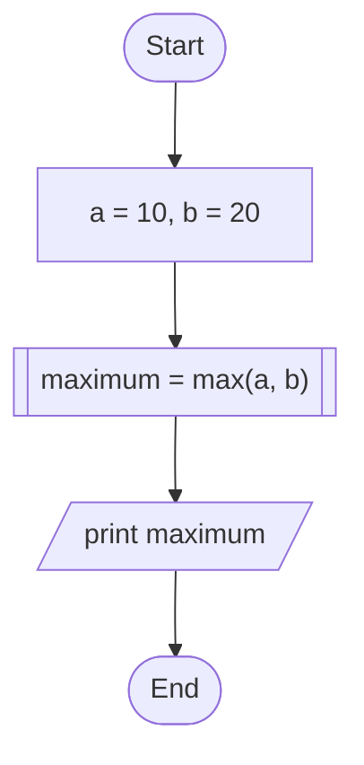

# Lecture 5: Functions and Macros
## {{ $slidev.configs.subject }}
### Semester {{ $slidev.configs.semester }}
#### Presented by {{ $slidev.configs.presenter }}

---
layout: two-cols
---

## Lecture Outline

1.  **Functions: The Building Blocks**
    *   Declaration, Definition, and Calling
    *   Prototypes and Header Files (`.h`/`.c`)
    *   Argument Passing: Pass-by-Value

2.  **Recursive Functions**
    *   Base Cases and Recursive Steps
    *   Examples: Factorial and Fibonacci
    *   Recursion vs. Iteration

:: right ::

3.  **Variable Scope and Lifetime**
    *   Local vs. Global Scope
    *   Automatic vs. Static Lifetime
    *   The `static` Keyword


4.  **The Preprocessor and Macros**
    *   `#include` for Header Files
    *   `#define` for Constants and Function-Like Macros

---

## Overview of Functions

* We've already encountered several built-in C functions:
    * `int main()`: The program's entry point.
    * `int printf()`: For formatted output.
    * `int scanf()`: For formatted input.
    * `float sqrt()`: Calculates square root (from `math.h`).
    * `float floor()`: Finds the largest integer less than or equal to a value (from `math.h`).
    * `float fabs()`: Calculates absolute value for floats (from `math.h`).
* Functions in C are analogous to mathematical functions like $f(x) = \sin(x)$ or $g(x) = x^2$.
* C functions are generally more versatile.
* This lecture focuses on how to structure our code effectively by creating our own functions (code blocks).

---

## Why Use Functions? 

* We are already familiar with using standard library functions like `printf`, `scanf`, `sqrt`, etc.
* Creating our own functions offers significant benefits:
    * **Modularity:** Breaks down complex problems into smaller, manageable, independent units.
    * **Reusability:** Write a piece of code once (in a function) and call it multiple times from different parts of the program, avoiding repetition.
        * Imagine calculating the factorial $n!$ multiple times in a program. Instead of repeating the factorial calculation logic each time, we can write a single `factorial` function and call it whenever needed.
        * This principle of "Don't Repeat Yourself" (DRY) is fundamental to good software engineering.
    * **Readability:** Well-named functions make code easier to understand by describing *what* a block of code does rather than just *how* it does it.
    * **Maintainability & Debugging:** Easier to test, debug, and update smaller, isolated functions than one large block of code.


---

## Lecture Outline

1.  **Functions: The Building Blocks**
    *   **Declaration, Definition, and Calling**
    *   Prototypes and Header Files (`.h`/`.c`)
    *   Argument Passing: Pass-by-Value

2.  Recursive Functions
3.  Variable Scope and Lifetime
4.  The Preprocessor and Macros

---
layout: two-cols-header
---

## Function Definition: Syntax

:: left ::

* Defining a function means providing the code that executes when the function is called.


* **General Syntax:**
    ```c
    return_type function_name(parameter_list) {
        // Function Body:
        // Declarations and statements...
        // ... code to perform the function's task ...
        return return_value; // Optional, depends on return_type
    }
    ```
* **Components:**
    * `return_type`: The data type of the value the function sends back (e.g., `int`, `float`, `char`, `void` if nothing is returned).
    * `function_name`: A unique identifier for the function.

:: right ::

* `parameter_list`: A comma-separated list of variable declarations (type and name) for the inputs the function receives (e.g., `int count`, `float price`). Can be empty or `void` if no parameters.
* `Function Body`: The block of code `{ ... }` containing the logic.
* `return return_value;`: Sends a value back to the caller. The `return_value` must match the `return_type`. Omitted if `return_type` is `void`.

---
layout: two-cols-header
---

## Function Definition Example: `max`

:: left ::

* **Problem:** Create a function that returns the larger of two integers.

```c {4-23}{lines: true,maxHeight: '400px'}
#include <stdio.h>

// Function Definition
int max(int num1, int num2) { // Returns int, takes two int parameters
    int result; // Local variable within the function

    if (num1 > num2) {
        result = num1;
    } else {
        result = num2;
    }

    // Return the larger value
    return result;
}

// Example Usage (in main or another function)
int main() {
    int a = 10, b = 20;
    int maximum = max(a, b); // Call the function
    printf("The maximum is: %d\n", maximum); // Output: 20
    return 0;
}
```

:: right ::

<div style="padding-left:50px">

</div>

<div style="position:fixed;top:160px;right:350px;">

</div>


---
layout: two-cols-header
---


## Function Definition Example: `sum`

:: left ::


* **Problem:** Calculate the sum of integers from 1 to N.

```c {*}{lines:'true'}
#include <stdio.h>
// Function Definition
int sum(int n) { // Returns int, takes one int parameter
    int i;
    int total = 0; // Initialize sum

    for (i = 1; i <= n; i++) {
        total += i;
    }

    // Return the calculated sum
    return total;
}

// Example Usage
int main() {
    int limit = 5;
    int result = sum(limit); // Call the function
    printf("Sum from 1 to %d is: %d\n", limit, result); // Output: 15
    return 0;
}
```
:: right ::

<div style="padding-left:50px">

</div>

<div style="position:fixed;top:130px;right:380px;">

</div>


---

## Functions Returning `void`


* If a function doesn't need to send a value back to the caller (e.g., it just performs an action like printing), its `return_type` should be `void`.
* A `return;` statement (with no value) can be used to exit a `void` function early, but it's often omitted if execution naturally reaches the end of the function body.

```c
#include <stdio.h>
// Function Definition (returns nothing)
void print_greeting(int times) { // Returns void
    int i;
    for (i = 0; i < times; i++) {
        printf("Hello! ");
    }
    printf("\n");
    // No return value needed (or just 'return;')
}
// Example Usage
int main() {
    print_greeting(3); // Call the function
    return 0;
}
// Output: Hello! Hello! Hello!
```

---
layout: two-cols
---

## Function Types: `void` return, `void` parameters

*   A function that performs an action but doesn't return any value and doesn't need any input.

```c {*}{lines:'true'}
#include <stdio.h> 

// Function Definition
void print_message(void) { // Returns void, takes no parameters
    printf("This is a message from a void function.\n");
}

// Example Usage
int main() {
    print_message(); // Call the function
    return 0;
}
```

:: right ::

*Output:*
```text
This is a message from a void function.
```

*   Useful for simple actions like printing a fixed message or performing an internal setup.

<br>
<div style="padding-left:100px">

</div>

---
layout: two-cols
---

## Function Types: `value` return, `void` parameters
*   A function that calculates or retrieves a value and returns it, but doesn't need any input from the caller.

```c {*}{lines:'true'}
#include <stdio.h> 

// Function Definition
int get_fixed_value(void) { // Returns int, takes no parameters
    return 42; // Returns a fixed integer value
}

// Example Usage
int main() {
    int value = get_fixed_value(); // Call the function
    printf("The fixed value is: %d\n", value);
    return 0;
}
```

:: right ::

*Output:*
```text
42
```

*   Useful for functions that provide a constant, generate a random number, or read a global setting.

<br>

<div style="padding-left:100px">

</div>

---
layout: two-cols
---

## Function Types: `value` return, with `parameters`
*   A function that takes input(s), performs a computation or operation, and returns a result. This is a very common type of function.

```c {*}{lines:'true'}
#include <stdio.h> 

// Function Definition
double multiply(double a, double b) { // Returns double, takes two double parameters
    return a * b;
}

// Example Usage
int main() {
    double num1 = 10.5, num2 = 2.0;
    double product = multiply(num1, num2); // Call the function
    printf("Product: %.2f\n", product);
    return 0;
}
```

:: right ::

*Output:*
```text
Product: 21.00
```

*   These functions are the workhorses for calculations and data transformations.

<br>

<div style="padding-left:60px">

</div>


---
layout: two-cols
---

## Function Types: `void` return, with `parameters`
*   A function that takes input(s) and performs an action based on those inputs, but doesn't return any value.

```c {*}{lines:'true'}
#include <stdio.h> 

// Function Definition
void print_sum_and_diff(int x, int y) { // Returns void, takes two int parameters
    printf("Sum: %d\n", x + y);
    printf("Difference: %d\n", x - y);
}

// Example Usage
int main() {
    print_sum_and_diff(50, 15); // Call the function
    return 0;
}
```

:: right ::

*Output:*
```text
Sum: 65
Difference: 35
```

*   Useful for functions that directly interact with the user (e.g., printing), modify global variables, or perform I/O operations.

<br>

<div style="padding-left:100px">


</div>

---
layout: two-cols-header
---

## Function Declaration (Prototypes)
* Before you can *call* a function, the compiler needs to know about its existence, return type, name, and parameter types.
* You achieve this by providing a **function declaration** (also called a **prototype**) *before* the first call.

:: left ::

* **Syntax:** `return_type function_name(parameter_type_list);`
    * It looks like the first line of the function definition, but ends with a semicolon `;` and doesn't include the function body `{}`.
    * Parameter names are optional in the declaration, but types are required.

```c {*}{lines:'true',maxHeight:'160px'}
// Function Declaration (Prototype)
int max(int num1, int num2); // Tells compiler 'max' exists

int main() {
    int m = max(10, 5); // OK: Compiler knows 'max' from declaration
    printf("Max is %d\n", m);
    return 0;
}

// Function Definition (can appear later in the file or in another file)
int max(int num1, int num2) {
    return (num1 > num2) ? num1 : num2;
}
```

:: right ::

* **Why declare?** Allows functions to be defined in any order or even in separate files. Standard library functions (like `printf`) are declared in header files (`stdio.h`) that we `#include`.

---
layout: two-cols-header
---

## Header Files (`.h`) vs. Source Files (`.c`): Example

:: left ::

* **Declarations (`.h` files):** Function prototypes, global variable declarations (`extern`), type definitions (`struct`, `enum`), and macro definitions (`#define`) are often placed in header files. These files describe the *interface* of a code module.
* **Definitions (`.c` files):** The actual function bodies (code implementations) and global variable definitions are placed in source files. These files contain the *implementation*.
* **Usage:** Source files (`.c`) typically `#include` the header files (`.h`) they need to access the declared functions, variables, etc. This promotes modularity and organization in larger projects.

:: right ::

<div style="padding-top: 20px;">

</div>

---
layout: two-cols-header
---

### Complilation with Header Files (`.h`) Source Files (`.c`)

:: left ::

<div style="padding-right:20px">


**`math_utils.h` (Header File)**
```c
// This is a header guard. It prevents the header
// from being included multiple times.
#ifndef MATH_UTILS_H
#define MATH_UTILS_H

// Function prototype (declaration)
// Describes what the function does, but not how.
int add(int a, int b);

#endif // MATH_UTILS_H
```

**`math_utils.c` (Source File)**
```c
#include "math_utils.h" // Include the header for consistency

// Function definition (implementation)
// This is the actual code for the function.
int add(int a, int b) {
    return a + b;
}
```

</div>


:: right ::

**`main.c` (Main Program)**
```c
#include <stdio.h>
#include "math_utils.h" // Include our custom header

int main() {
    int x = 5, y = 7;
    // We can use add() because its prototype
    // was included from math_utils.h
    int result = add(x, y);
    printf("The sum is: %d\n", result);
    return 0;
}
```

**Compilation**
To compile this multi-file project:
```bash
gcc main.c math_utils.c -o my_program
```


---
layout: two-cols
---


## Function Calling

* To execute a function, you "call" it by using its name followed by parentheses `()`.
* If the function takes parameters, you provide values (arguments) inside the parentheses, matching the types declared in the parameter list.
* **Pass-by-Value:** In C, arguments are passed **by value**. This means a *copy* of the argument's value is sent to the function. The function works with this copy. **Modifying the parameter variable inside the function does *not* affect the original argument variable in the caller.**

:: right ::

<div style="padding-left:90px">

*Pass-by-Value Example:*


</div>


---
layout: two-cols-header
---

## Function Call Example: Pass-by-Value

:: left ::

<div style="padding-right:25px">


*function try_to_modify:*
```c 
#include <stdio.h>

// Function tries to modify its parameter (a copy)
void try_to_modify(int x) {
    printf("Inside function (before): x = %d\n", x);
    x = 9; // Modifies the local copy 'x'
    printf("Inside function (after): x = %d\n", x);
}

int main() {
    int original_value = 10;
    printf("In main (before call): original_value = %d\n", original_value);

    // Call the function, passing the value of original_value
    try_to_modify(original_value);

    // Check the original variable - it remains unchanged!
    printf("In main (after call): original_value = %d\n", original_value);
    return 0;
}
```
</div>

:: right ::

*Output:*
```text
In main (before call): original_value = 10
Inside function (before): x = 10
Inside function (after): x = 9
In main (after call): original_value = 10
```

---
layout: two-cols-header
hide: true
---

## Function Call Example: Multiple Parameters

:: left ::

* **Problem:** Create a function to display a product's details.

```c {*}{lines:'true'}
#include <stdio.h>

// Function Definition
// Takes an integer, a float, and a character
void display_product(int id, float price, char grade) {
    printf("Product Details:\n");
    printf("  ID: %d\n", id);
    printf("  Price: %.2f\n", price);
    printf("  Grade: %c\n", grade);
}

// Example Usage
int main() {
    // Call the function with different data types
    display_product(1001, 19.99, 'A');
    return 0;
}
```

:: right ::

*Output:*
```text
Product Details:
  ID: 1001
  Price: 19.99
  Grade: A
```

*   This example shows how a single function can accept arguments of various basic data types (`int`, `float`, `char`).
*   The function call must provide arguments in the correct order and of the correct type as specified in the function's parameter list.

---
hide: true
---

## Function Call Stack (Conceptual)


* When a function is called, the system uses a **call stack** to manage execution:
    1.  **Push:** Information about the current function (like where to return to) and space for the called function's local variables and parameters (copies of arguments) are pushed onto the stack.
    2.  **Execute:** The called function runs using its local variables and parameters.
    3.  **Pop:** When the called function returns, its information is popped off the stack, and control returns to the calling function at the point right after the call. The return value (if any) is passed back.

---

## Lecture Outline

1.  Functions: The Building Blocks

2.  **Recursive Functions**
    *   **Base Cases and Recursive Steps**
    *   Examples: Factorial and Fibonacci
    *   Recursion vs. Iteration

3.  Variable Scope and Lifetime
4.  The Preprocessor and Macros

---

## Recursive Functions

* A function is **recursive** if it calls itself, either directly or indirectly.
* Recursion provides an elegant way to solve problems that can be broken down into smaller, self-similar subproblems.
* **Essential Components of Recursion:**
    1.  **Base Case(s):** One or more simple conditions where the function does *not* call itself, stopping the recursion. Without a base case, recursion leads to infinite calls and usually a **stack overflow** error.
    2.  **Recursive Step:** The part where the function calls itself, typically with modified arguments that move closer to the base case.

---
layout: two-cols-header
---

## Recursion Example: Factorial

:: left ::

* **Problem:** Calculate N! (N * (N-1) * ... * 1).
* **Recursive Definition:**
    * Base Case: `factorial(0) = 1`
    * Recursive Step: `factorial(N) = N * factorial(N-1)` for N > 0.

```c {4-14}{maxHeight:'200px',lines:'true'}
#include <stdio.h>

// Recursive factorial function
long long factorial(int n) {
    // Base Case
    if (n == 0 || n == 1) {
        return 1;
    }
    // Recursive Step
    else {
        // Calls itself with a smaller value (n-1)
        return (long long)n * factorial(n - 1);
    }
}

int main() {
    int num = 5;
    printf("Factorial of %d = %lld\n", num, factorial(num)); // Output: 120
    return 0;
}
```

*Each call `factorial(n)` pushes a new frame onto the call stack until `factorial(0)` is reached (base case). Then the results are multiplied back up as the stack unwinds.*

:: right ::


---
layout: two-cols-header
---

## Recursion Example: Fibonacci Sequence


* **Problem:** Calculate the Nth Fibonacci number (F(N)).
* **Sequence:** 0, 1, 1, 2, 3, 5, 8, 13, ...

:: left ::

* **Recursive Definition:**
    * Base Cases: `F(0) = 0`, `F(1) = 1`
    * Recursive Step: `F(N) = F(N-1) + F(N-2)` for N > 1.

```c {4-14}{maxHeight:'200px',lines:'true'}
#include <stdio.h>

// Recursive Fibonacci function
int fibonacci(int n) {
    // Base Cases
    if (n <= 0) {
        return 0;
    } else if (n == 1) {
        return 1;
    }
    // Recursive Step
    else {
        // Calls itself twice
        return fibonacci(n - 1) + fibonacci(n - 2);
    }
}

int main() {
    int num = 6;
    printf("Fibonacci number F(%d) = %d\n", num, fibonacci(num)); // Output: 8
    return 0;
}
```

*Note: This recursive Fibonacci implementation is elegant but highly inefficient due to repeated calculations. An iterative (loop-based) approach is usually preferred.*

:: right ::


---

## Recursion vs. Iteration (Loops)

* Any problem solvable with recursion can also be solved using iteration (loops), and vice versa.
* **Recursion:**
    * Often leads to more concise, elegant code that mirrors the mathematical definition.
    * Can have significant overhead due to function call stack usage.
    * Risk of stack overflow if recursion depth is too large.
* **Iteration:**
    * Generally more efficient in terms of speed and memory usage (no stack overhead).
    * Can sometimes be less intuitive or harder to write than the recursive equivalent.
* Choose the approach that results in clearer, more maintainable code for the specific problem, while considering performance implications.

---

## Lecture Outline

1.  Functions: The Building Blocks
2.  Recursive Functions

3.  **Variable Scope and Lifetime**
    *   **Local vs. Global Scope**
    *   **Automatic vs. Static Lifetime**
    *   The `static` Keyword

4.  The Preprocessor and Macros

---

## Variable Scope

* **Scope** defines the region of the program where a variable can be accessed or referenced by its name.
* **Block Scope (Local Variables):**
    * Variables declared *inside* a block (code enclosed in `{}`) or within a function's parameter list.
    * Accessible only from the point of declaration to the end of that specific block (`}`).
    * Includes function parameters and variables declared inside functions, `if`, `for`, `while` blocks, etc.
* **File Scope (Global Variables):**
    * Variables declared *outside* of any function.
    * Accessible from the point of declaration to the end of the entire source file (`.c` file).
    * Generally discouraged unless necessary, as they can make code harder to track and debug.

---

## Scope Example

```c {*}{maxHeight:'430px',lines:'true'}
#include <stdio.h>

// File Scope (Global Variable)
int global_var = 100;

void some_function(int param) { // 'param' has function scope
    // Local variable with function scope
    int function_local = 20;
    printf("Inside function: param=%d, function_local=%d, global_var=%d\n",
           param, function_local, global_var);

    if (param > 5) {
        // Local variable with block scope (inside 'if')
        int block_local = 30;
        printf("Inside if block: block_local=%d\n", block_local);
        // Can still access function_local and global_var here
    }
    // printf("block_local = %d\n"); // Error! block_local not accessible here
}

int main() { // 'main' is also a function
    // Local variable within main
    int main_local = 10;
    printf("Inside main: main_local=%d, global_var=%d\n",
           main_local, global_var);
    // printf("function_local = %d\n"); // Error! function_local not accessible here

    some_function(main_local); // Pass value of main_local
    return 0;
}
```

---

## Variable Lifetime

* **Lifetime** refers to the duration during program execution for which a variable exists in memory.
* **Automatic Storage Duration (Typical for Local Variables):**
    * Variables with block scope (non-`static` locals, parameters).
    * Memory is allocated automatically when the defining block is entered.
    * Memory is automatically deallocated when the block is exited.
    * Value is lost between block entries/function calls.
* **Static Storage Duration (Global Variables, `static` Locals):**
    * Global variables (file scope).
    * Local variables declared with the `static` keyword.
    * Memory is allocated once when the program starts and persists until the program ends.
    * Retain their value between function calls (`static` locals) or are accessible throughout the program's execution (globals).

---

## The `static` Keyword with Local Variables

* When `static` is used with a local variable declaration inside a function:
    1.  **Lifetime:** Becomes static (persists for the entire program execution).
    2.  **Scope:** Remains local (only accessible within that function/block).
    3.  **Initialization:** Initialized only *once*, the first time the function is called. Retains its value across subsequent calls.

```c {*}{maxHeight:'270px'}
#include <stdio.h>

void counter_function() {
    // Automatic local variable (re-initialized each call)
    int auto_count = 0;
    // Static local variable (initialized once, retains value)
    static int static_count = 0;

    auto_count++;
    static_count++;
    printf("auto_count = %d, static_count = %d\n", auto_count, static_count);
}

int main() {
    printf("Calling function:\n");
    counter_function(); // auto=1, static=1
    counter_function(); // auto=1, static=2
    counter_function(); // auto=1, static=3
    return 0;
}
```

---

## Lecture Outline

1.  Functions: The Building Blocks
2.  Recursive Functions
3.  Variable Scope and Lifetime

4.  **The Preprocessor and Macros**
    *   `#include` for Header Files
    *   `#define` for Constants and Function-Like Macros

---

## The C Preprocessor

* Before the actual C compiler translates your code into machine language, a preliminary step called **preprocessing** occurs.
* The **preprocessor** reads your source code (`.c` file) and acts on special instructions called **preprocessor directives**, which all start with `#`.
* It modifies the source code text based on these directives, producing a temporary, expanded source file that is then fed to the compiler.
* Common Preprocessor Tasks:
    * Including header files (`#include`).
    * Defining macros and symbolic constants (`#define`).
    * Conditional compilation (`#ifdef`, `#ifndef`, `#if`, `#else`, `#elif`, `#endif`).

---

## `#include` Directive

* `#include <filename.h>`: Includes standard system header files (searches system paths). Angle brackets `<>` are used.
* `#include "filename.h"`: Includes user-defined header files (searches current directory first, then system paths). Double quotes `""` are used.
* The preprocessor replaces the `#include` line with the entire textual content of the specified header file.
* This is how declarations for library functions (like `printf` in `stdio.h`) become available to your code before compilation.

---

## `#define` Directive: Symbolic Constants

* Used to define symbolic names (macros) that will be replaced by specified text before compilation. Often used for constants.
* **Syntax:** `#define IDENTIFIER replacement_text`
* The preprocessor performs a simple text substitution wherever `IDENTIFIER` appears in the code (outside of strings/comments) with `replacement_text`.
* **Convention:** Use uppercase for macro constants to distinguish them from variables.
* **No semicolon `;` at the end!**

```c {*}{maxHeight:'200px'}
#include <stdio.h>

// Define symbolic constants
#define PI 3.14159
#define MAX_VALUE 100

int main() {
    // Preprocessor replaces PI with 3.14159 before compilation
    double circumference = 2 * PI * 10.0;
    // Preprocessor replaces MAX_VALUE with 100
    if (circumference > MAX_VALUE) {
        printf("Circumference exceeds max value.\n");
    }
    printf("Circumference: %f\n", circumference);
    return 0;
}
```

---

## `#define` Directive: Function-Like Macros

* Macros can also take arguments, mimicking function calls (but working via text substitution).
* **Syntax:** `#define MACRO_NAME(param1, param2, ...) replacement_text`
* **Warning:** Function-like macros can be tricky and have pitfalls due to simple text replacement, especially regarding operator precedence and multiple evaluations of arguments. Use parentheses generously in the replacement text!

```c {*}{maxHeight:'200px'}
#include <stdio.h>

// Simple macro (constant)
#define LIMIT 10

// Function-like macro (use parentheses!)
#define SQUARE(x) ((x) * (x))
#define MAX(a, b) (((a) > (b)) ? (a) : (b))

int main() {
    int num = 5;
    int sq = SQUARE(num); // Replaced by: int sq = ((num) * (num));
    int another_sq = SQUARE(num + 1); // Replaced by: ((num + 1) * (num + 1))

    int x = 3, y = 7;
    int maximum = MAX(x, y); // Replaced by: (((x) > (y)) ? (x) : (y))

    printf("Square of %d is %d\n", num, sq); // Output: 25
    printf("Square of %d is %d\n", num + 1, another_sq); // Output: 36
    printf("Max of %d and %d is %d\n", x, y, maximum); // Output: 7
    return 0;
}
```

* **Pitfall Example:** `#define SQUARE_BAD(x) x * x`. If called as `SQUARE_BAD(num + 1)`, it expands to `num + 1 * num + 1`, which calculates incorrectly due to operator precedence.


---
layout: two-cols
---

## Summary

*   **Functions:** Reusable blocks of code that improve modularity and readability. Key components are the return type, name, parameters, and body.
*   **Declaration vs. Definition:** A function must be *declared* (prototype) before it is *called* so the compiler knows its signature. The *definition* contains the actual code.
*   **Pass-by-Value:** C passes arguments to functions by value, meaning the function receives a *copy* and cannot modify the original argument variable.
*   **Recursion:** A function that calls itself. Requires a **base case** to stop the recursion and a **recursive step** that moves closer to the base case.

:: right ::

*   **Scope & Lifetime:**
    *   **Scope** (where a variable is accessible): Local/Block scope vs. Global/File scope.
    *   **Lifetime** (how long a variable exists): Automatic (local) vs. Static (global, `static` locals).
*   **Preprocessor & Macros:**
    *   The preprocessor modifies code *before* compilation.
    *   `#include` incorporates header files.
    *   `#define` creates text-substitution macros for constants or simple operations.


<div style="position:fixed;bottom:0;right:20px;padding-bottom:30px">
<Link to="lab5" title="Go to Lab5 👩‍🔬"/>
</div>
