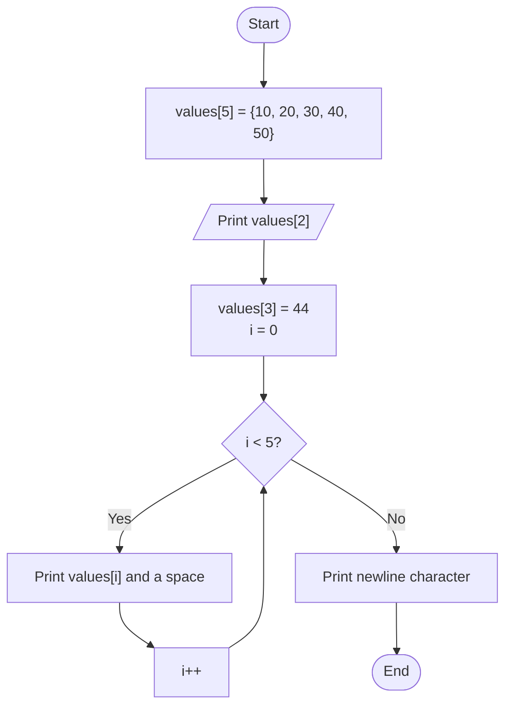
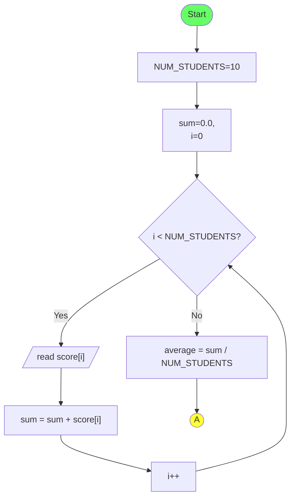
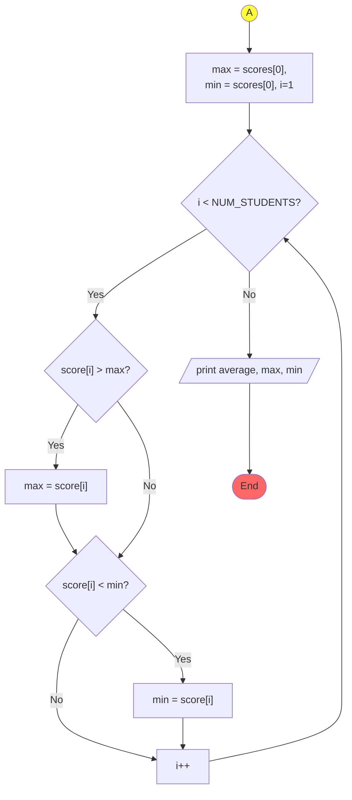
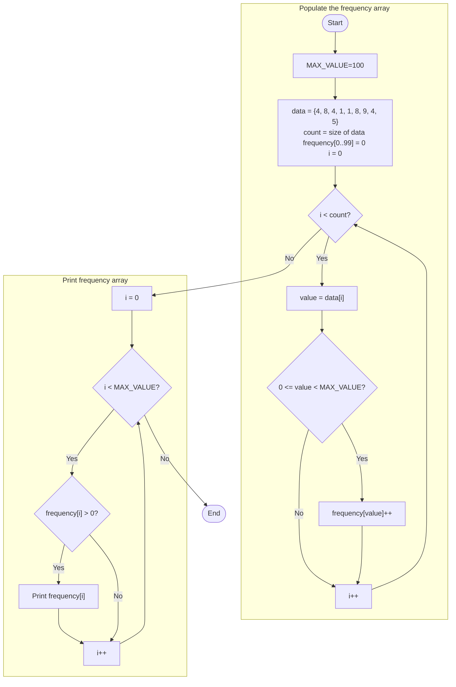
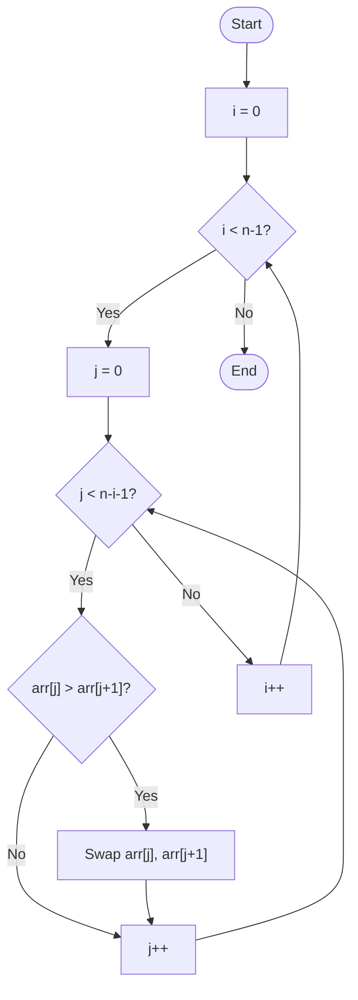

# Lecture 6: Arrays
## {{ $slidev.configs.subject }}
### Semester {{ $slidev.configs.semester }}
#### Presented by {{ $slidev.configs.presenter }}

---

## Lecture Outline

1.  **The Need for Collections**
    *   Motivating Example: Handling Multiple Data Items
2.  **One-Dimensional (1D) Arrays**
    *   Declaration, Initialization & Access
    *   The `sizeof` Operator with Arrays
    *   Processing Arrays with Loops
3.  **Arrays and Functions**
    *   Pass-by-Value vs. Pass-by-Reference
    *   Passing 1D Arrays to Functions
4.  **Two-Dimensional (2D) Arrays**
    *   Declaration, Initialization & Access
    *   Passing 2D Arrays to Functions
5.  **A Critical Pitfall**
    *   Array Bounds and Undefined Behavior

---

## Motivating: Handling Multiple Data Items

* **Problem:** Consider needing to process the math scores for 10 students in a class. Tasks might include calculating the sum, average, max/min score, or ranking them.
* **Approach Using Only Simple Variables:** We would need to declare 10 separate `float` variables (e.g., `x1`, `x2`, ..., `x10`). Reading input and calculating the sum would involve repetitive code for each variable:
    ```c
    float x1, x2, ..., x10;
    float sum = 0.0;
    scanf("%f", &x1); sum += x1;
    scanf("%f", &x2); sum += x2;
    // ... repeat 10 times ...
    ```
* **Challenge:** This becomes extremely cumbersome if we have 100 or 1000 students. 
* **Using Loop?** How can we access different variables in a loop using a loop counter (e.g., `i`)?
    ```c
    for(int i=1; i<=10; i++) {
      scanf("%f", &xi); sum += xi; // This is NOT valid C code!
    }
    
    ```
* This is where **Arrays** come in. An array lets us store and manage a collection of similar data items under a single `name`, accessed by a numerical `index`.

---

## Introduction to 1D Arrays

* An **array** is a data structure that stores a fixed-size, sequential collection of elements of the **same data type**.
* Think of it as a numbered list of variables stored together.
* **Declaration Syntax:**
    `data_type array_name[array_size];`
    * `data_type`: The type of elements the array will hold (e.g., `int`, `float`, `char`).
    * `array_name`: The identifier used to refer to the array.
    * `array_size`: A positive integer constant specifying the number of elements.
* **Memory:** Array elements are stored contiguously (one after another) in memory.
* **Indexing:** Individual elements are accessed using an **index** (or subscript), starting from **0** for the first element up to `array_size - 1` for the last element.

```c
// Declare an array named 'scores' that can hold 10 integers.
int scores[10]; // Elements are scores[0], scores[1], ..., scores[9]

// Declare an array named 'prices' that can hold 5 floating-point numbers.
float prices[5]; // Elements are prices[0], prices[1], ..., prices[4]
```

---
layout: two-cols-header
---

## Arrays in Memory: Indexing and Addresses
A key feature of arrays is that their elements are stored in a single, unbroken block of memory. This is called **contiguous storage**.
::left::
* When you declare an array like `int data[5];`, the compiler reserves a continuous block of memory large enough to hold 5 integers.
* The array's name (e.g., `data`) acts as a reference to the **base address**—the memory location of the very first element (`data[0]`)
* When you access an element like `data[i]`, the computer performs a quick calculation to find its memory address:
    
    `address(data[i]) = base_address + (i * sizeof(int))`

::right::
* Consider `int data[5];` where `sizeof(int)` is 4 bytes and the array's base address is `0x1000`.

```text
      Index:      [0]      [1]      [2]      [3]      [4]
                 +--------+--------+--------+--------+--------+
Array `data`:    |        |        |        |        |        |
                 +--------+--------+--------+--------+--------+
Memory Address:  0x1000   0x1004   0x1008   0x100C   0x1010
```

*   **`data[0]`**: Located at `0x1000 + (0 * 4)` which is `0x1000`.
*   **`data[3]`**: Located at `0x1000 + (3 * 4)` which is `0x1000 + 12`, or `0x100C` in hexadecimal.

This is why indices start at 0. The index is an **offset** from the base address.

---

## Array Initialization

* You can initialize an array when you declare it using curly braces `{}`.
    1.  **Full Initialization:** Provide values for all elements.
        ```c
        int numbers[5] = {10, 20, 30, 40, 50};
        // numbers[0]=10, numbers[1]=20, ..., numbers[4]=50
        ```
    2.  **Partial Initialization:** Provide fewer values than the size. Remaining elements are automatically initialized to zero (for numeric types).
        ```c
        float rates[5] = {1.1, 2.2};
        // rates[0]=1.1, rates[1]=2.2, rates[2]=0.0, rates[3]=0.0, rates[4]=0.0
        ```
    3.  **Size Omission:** If initializing, you can omit the size; the compiler determines it from the number of initializers.
        ```c
        char vowels[] = {'a', 'e', 'i', 'o', 'u'};
        // Compiler creates an array of size 5.
        ```
    4.  **Designated Initializers (C99+):** Initialize specific elements by index.
        ```c
        int data[10] = {[2] = 99, [0] = 10, [5] = 55};
        // data[2]=99, data[0]=10, data[5]=55. Others are 0.
        ```

---
layout: two-cols-header
---

## Accessing and Processing Array Elements


* Use the array name followed by the index in square brackets `[]` to access or modify an element.
::left::
* Loops are the natural way to process all elements of an array.

```c {*}{lines:true}
#include <stdio.h>

int main() {
    int values[5] = {10, 20, 30, 40, 50};

    // Access and print a single element
    printf("The third element is: %d\n", values[2]); // Output: 30

    // Modify an element
    values[3] = 44;

    // Use a loop to print all elements
    printf("All values: ");
    for (int i = 0; i < 5; i++) {
        printf("%d ", values[i]);
    }
    printf("\n"); // Output: 10 20 30 44 50

    return 0;
}
```

::right::




---

## The `sizeof` Operator and Arrays

* The `sizeof` operator can be used to find the total size of an array in bytes.
* This allows you to calculate the number of elements in an array programmatically, which makes code more robust.

```c
int data[] = {4, 8, 4, 1, 1, 8, 9, 4, 5};

// Get total size of the array in bytes
size_t total_size = sizeof(data); // e.g., 9 elements * 4 bytes/int = 36 bytes

// Get size of one element in bytes
size_t element_size = sizeof(data[0]); // e.g., 4 bytes

// Calculate the number of elements
int count = total_size / element_size; // 36 / 4 = 9

// Now you can use 'count' in your loops
for (int i = 0; i < count; i++) {
    // ... process data[i] ...
}
```

* **Important:** This trick only works in the same scope where the array is declared. It **does not work** on array parameters inside functions (as we'll see next).

---
layout: two-cols-header
---

## Example: Student Scores Revisited (Using Arrays)

:: left ::

*   This code is much cleaner and easily adaptable for 100 or 1000 students by just changing `NUM_STUDENTS`.

```c {*}{maxHeight: '330px', lines: 'true'}
#include <stdio.h>
#define NUM_STUDENTS 10

int main() {
    float scores[NUM_STUDENTS];
    float sum = 0.0, average, max, min;
    int i;

    // Input scores using a loop
    printf("Enter %d scores:\n", NUM_STUDENTS);
    for (i = 0; i < NUM_STUDENTS; i++) {
        scanf("%f", &scores[i]);
        sum += scores[i];
    }

    // Calculate average
    average = sum / NUM_STUDENTS;

    // Find max and min scores
    max = min = scores[0];
    for (i = 1; i < NUM_STUDENTS; i++) {
        if (scores[i] > max) max = scores[i];
        if (scores[i] < min) min = scores[i];
    }

    // Output results
    printf("Average: %.2f\n", average);
    printf("Max: %.2f, Min: %.2f\n", max, min);
    return 0;
}
```

:: right ::



<div style="top:20px;right:10px;position:absolute">

</div>

---
layout: two-cols-header
---

## Example: Frequency Counting
:: left ::
*   A common task is to count how many times each number appears in a dataset.
*   We use a second "frequency" array where the *index* corresponds to a value from the original `data` array.


```c {*}{maxHeight:'300px',lines:true}
#include <stdio.h>

// Assume values in the array are in the range 0-99
#define MAX_VALUE 100

int main() {
    int data[] = {4, 8, 4, 1, 1, 8, 9, 4, 5};
    int count = sizeof(data) / sizeof(data[0]);

    // frequency[i] will store the count of number 'i'
    int frequency[MAX_VALUE] = {0}; // Initialize all counts to zero

    // Populate the frequency array
    for (int i = 0; i < count; i++) {
        int value = data[i];
        if (value >= 0 && value < MAX_VALUE) {
            frequency[value]++;
        }
    }

    // Print the frequencies
    printf("Element Frequencies:\n");
    for (int i = 0; i < MAX_VALUE; i++) {
        if (frequency[i] > 0) {
            printf("Value %d appeared %d time(s).\n", i, frequency[i]);
        }
    }

    return 0;
}
```

::right::

<div style="top:10px;right:10px;position:absolute">


</div>


---

## Example: Sorting with Bubble Sort
<div style="padding-right:130px">

*   **Bubble Sort** is a simple sorting algorithm that repeatedly steps through the list, compares adjacent elements, and swaps them if they are in the wrong order. The pass through the list is repeated until the list is sorted.
*   The outer loop ensures that we pass through the array enough times to sort it completely.
*   The inner loop "bubbles" the largest unsorted element to its correct position at the end of the unsorted part of the array.

</div>

<div style="padding-right:150px">
```c {*|8-17}{maxHeight:'250px', lines: 'true'}
#include <stdio.h>

int main() {
    int arr[] = {64, 34, 25, 12, 22, 11, 90};
    int n = sizeof(arr)/sizeof(arr[0]);

    int i, j, temp;
    for (i = 0; i < n - 1; i++) {
        for (j = 0; j < n - i - 1; j++) {
            if (arr[j] > arr[j + 1]) {
                // swap arr[j] and arr[j+1]
                temp = arr[j];
                arr[j] = arr[j + 1];
                arr[j + 1] = temp;
            }
        }
    }
    
    printf("Sorted array: \n");
    // (code to print array would go here)
    return 0;
}
```
</div>


<div style="top:20px;right:10px;position:absolute">

</div>

---
 
## Array Bounds and Potential Errors

* A critical point in C: The language **does not automatically check** if the index you use to access an array element is within the valid range (0 to `size - 1`).
* Accessing elements outside these bounds (`array[-1]`, `array[size]`, `array[size + 1]`, etc.) leads to **undefined behavior**.
* **Undefined Behavior:** The program might crash, produce incorrect results, corrupt other data, or seemingly work correctly sometimes but fail later. It's unpredictable and dangerous.
* **Common Terms:**
    * **Buffer Overflow:** Writing past the end of the array.
    * **Buffer Underflow:** Writing before the beginning of the array (less common but possible with negative indices).
* **Responsibility:** It is the **programmer's responsibility** to ensure all array indices are within the valid bounds. Loops are common places where off-by-one errors can lead to out-of-bounds access (e.g., using `<=` instead of `<` with `size`).

---

## Out-of-Bounds Access Example

```c {*}{maxHeight:'400px',lines:true}
#include <stdio.h>

int main() {
    int arr[5] = {1, 2, 3, 4, 5}; // Valid indices: 0, 1, 2, 3, 4
    int bad_index = 5; // Invalid index! (Should be 0-4)
    int very_bad_index = 100; // Way outside
    int negative_index = -1; // Invalid

    printf("arr[0] = %d\n", arr[0]); // OK

    // Accessing OUTSIDE the array bounds - UNDEFINED BEHAVIOR!
    printf("Attempting access arr[5]...\n");
    // The following line might crash, print garbage, or seem to work...
    // printf("arr[5] = %d\n", arr[bad_index]);

    printf("Attempting access arr[100]...\n");
    // printf("arr[100] = %d\n", arr[very_bad_index]); // Even worse!

    printf("Attempting access arr[-1]...\n");
    // printf("arr[-1] = %d\n", arr[negative_index]); // Also undefined!

    printf("Attempting to WRITE outside bounds...\n");
    // arr[bad_index] = 999; // Corrupts memory outside the array!

    printf("Program continuing (maybe?)\n");
    return 0;
}
```

* Always be careful with array indices, especially in loops and calculations.

---

## Passing 1D Arrays to Functions

* When you pass an array to a function, you are not passing a copy of the entire array. Instead, you are passing the **memory address** of its first element.
* This means the function can directly access and **modify** the original array elements. This is known as **pass-by-reference** behavior.
* **Function Parameter Syntax:**
    * `void myFunction(int arr[], int size)` (preferred, clear it's an array)
    * `void myFunction(int* arr, int size)` (equivalent, uses pointer syntax)
* You must also pass the array's size as a separate parameter because the function itself doesn't know how big the array is. (`sizeof(arr)` inside the function would just give the size of a pointer, not the whole array).


---

## Passing 1D Arrays to Functions: Example

```c {*}{maxHeight:'430px',lines:true}
#include <stdio.h>

// This function takes an array and its size, and prints all its elements.
void printArray(int arr[], int size) {
    printf("Array contents: ");
    for (int i = 0; i < size; i++) {
        printf("%d ", arr[i]);
    }
    printf("\n");
}

// This function modifies an element in the original array.
void modifyArray(int arr[], int index, int newValue) {
    if (index >= 0) { // Basic bounds check
        arr[index] = newValue;
    }
}

int main() {
    int my_numbers[] = {10, 20, 30, 40, 50};
    int count = 5;

    printArray(my_numbers, count); // Pass array and size

    modifyArray(my_numbers, 2, 999); // Modify the element at index 2

    printf("After modification:\n");
    printArray(my_numbers, count); // The original array is changed!
    // Output: Array contents: 10 20 999 40 50

    return 0;
}
```

---
layout: two-cols-header
---

## Pass-by-Value vs. Pass-by-Reference

::left::

### Pass-by-Value (e.g., `int`, `float`)

*   A **copy** of the argument's value is passed to the function.
*   Changes inside the function **do not** affect the original variable.

<div style="padding-right:30px">

```c
void increment(int num) {
    num = num + 1; // num is a copy
}

int main() {
    int x = 10;
    increment(x);
    // x is still 10
    return 0;
}
```
</div>

::right::

### Pass-by-Reference (Arrays)

*   A **reference** (memory address) to the original array is passed.
*   Changes inside the function **do** affect the original array.

```c
void double_elements(int arr[], int size) {
    for (int i=0; i<size; i++) {
        arr[i] *= 2; // Modifies original
    }
}

int main() {
    int data[] = {1, 2, 3};
    double_elements(data, 3);
    // data is now {2, 4, 6}
    return 0;
}
```


---

## Introduction to 2D Arrays

* A 2D array can be thought of as an "array of arrays" or a grid/table with rows and columns.
* Useful for representing matrices, game boards, tables of data, images, etc.
* **Declaration Syntax:**
    `data_type array_name[num_rows][num_cols];`
* **Memory Layout:** Stored in **row-major order**. All elements of the first row are stored contiguously, followed by all elements of the second row, and so on.

```c
// Declare a 3x4 grid of integers (3 rows, 4 columns)
int matrix[3][4];

// Initialize a 2x3 integer array
int table[2][3] = {
    {1, 2, 3}, // Row 0 elements
    {4, 5, 6}  // Row 1 elements
};
```


---

## Initializing 2D Arrays

* Similar to 1D arrays, using nested curly braces `{}`. The outer braces enclose rows, and inner braces enclose elements within each row.

```c
// Initialize a 2x3 integer array
int table[2][3] = {
    {1, 2, 3}, // Row 0 elements
    {4, 5, 6}  // Row 1 elements
};

// Partial initialization (remaining elements become 0)
int data[3][4] = {
    {10, 11},      // Row 0: data[0][0]=10, data[0][1]=11, data[0][2]=0, data[0][3]=0
    {20},          // Row 1: data[1][0]=20, data[1][1]=0, data[1][2]=0, data[1][3]=0
    {30, 31, 32, 33} // Row 2: Fully initialized
};

// Can omit the first dimension size if initializing fully
int matrix[][3] = { {1,1,1}, {2,2,2} }; // Compiler determines 2 rows
```

---

## Accessing and Processing 2D Arrays

* Use two indices: `array_name[row_index][col_index]`. Both indices start at **0**.
* Nested loops are typically used to process 2D arrays.

```c {*}{maxHeight:'300px',lines:true}
#include <stdio.h>

int main() {
    int grid[2][3] = { {10, 20, 30}, {40, 50, 60} };

    // Modify an element
    grid[1][1] = 99; // Change element in row 1, column 1

    // Use nested loops to process the 2D array
    printf("Grid Contents:\n");
    for (int r = 0; r < 2; r++) {       // Loop through rows
        for (int c = 0; c < 3; c++) {   // Loop through columns
            printf("%d ", grid[r][c]);
        }
        printf("\n"); // Newline after each row
    }
    // Output:
    // 10 20 30
    // 40 99 60

    return 0;
}
```

---

## Passing 2D Arrays to Functions

* When passing a 2D array to a function, you must specify the size of the **columns**. The number of rows can be omitted.
* **Why?** The compiler needs the column size to calculate the memory offset for `array[row][col]`. It uses the formula: `address = base_address + (row * num_cols + col) * sizeof(element)`.
* **Function Parameter Syntax:**
    * `void myFunction(int arr[][COLS], int num_rows)` (preferred)

```c {*}{maxHeight:'200px',lines:true}
#include <stdio.h>
#define ROWS 2
#define COLS 3

// Function must know the number of columns
void print2DArray(int arr[][COLS], int num_rows) {
    for (int r = 0; r < num_rows; r++) {
        for (int c = 0; c < COLS; c++) {
            printf("%d ", arr[r][c]);
        }
        printf("\n");
    }
}

int main() {
    int matrix[ROWS][COLS] = {{1, 2, 3}, {4, 5, 6}};
    print2DArray(matrix, ROWS);
    return 0;
}
```

---
layout: two-cols-header
---

## 2D Arrays in Memory: Row-Major Order

::left::
* Even though we visualize a 2D array as a grid, in memory it is still a single, contiguous block of data. C stores 2D arrays in **row-major order**.
* To find the address of an element `data[r][c]`, the computer needs to know the number of columns (`NUM_COLS`) to calculate the offset correctly. The formula is:
    
    `addr(data[r][c]) = base + (r * NUM_COLS + c) * sizeof(type)`

    *   `r * NUM_COLS`: Skips over the previous rows.
    *   `+ c`: Moves to the correct column in the current row.
* This is why the column size **must** be specified when passing a 2D array to a function.

::right::

* Consider `int data[2][3];` where `sizeof(int)` is 4 bytes and the base address is `0x2000`.

    **Logical Grid:**
    ```text
          [0]  [1]  [2]
    [0]    A    B    C
    [1]    D    E    F
    ```

    **Physical Memory Layout (Row-Major):**
    ```text
        Row 0 Elements      Row 1 Elements
        +----+----+----+    +----+----+----+ 
        | A  | B  | C  |    | D  | E  | F  |
        +----+----+----+    +----+----+----+ 
    Mem: 0x2000 ... 0x2008  0x200C ... 0x2014
    ```

<Transform scale="0.8">

*   **`data[0][0]`**: `0x2000 + (0 * 3 + 0) * 4 = 0x2000`
*   **`data[1][1]`**: `0x2000 + (1 * 3 + 1) * 4 = 0x2000 + 16 = 0x2010`
</Transform>

---
layout: two-cols
---

## Common 2D Array Operations: Matrix Summation

* Matrix addition is a fundamental operation where two matrices of the **same dimensions** are added together to produce a third matrix, also of the same dimensions.

```c {*}{maxHeight:'280px',lines:true}
#include <stdio.h> 
#define ROWS 2
#define COLS 3

// Function to add two matrices and store the result in a third
void addMatrices(int a[][COLS], int b[][COLS], int result[][COLS], int num_rows) {
    for (int r = 0; r < num_rows; r++) {
        for (int c = 0; c < COLS; c++) {
            result[r][c] = a[r][c] + b[r][c];
        }
    }
}

int main() {
    int matrixA[ROWS][COLS] = {{1, 2, 3}, {4, 5, 6}};
    int matrixB[ROWS][COLS] = {{10, 11, 12}, {13, 14, 15}};
    int sum[ROWS][COLS];

    addMatrices(matrixA, matrixB, sum, ROWS);

    // (Code to print the 'sum' matrix would go here)
    printf("Resultant Matrix:\n");
    for (int r = 0; r < ROWS; r++) {
        for (int c = 0; c < COLS; c++) {
            printf("%d ", sum[r][c]);
        }
        printf("\n");
    }
    // Output:
    // 11 13 15
    // 17 19 21

    return 0;
}
```

:: right ::


* The operation is performed **element-wise**. This means that each element in the resulting matrix is the sum of the elements at the corresponding positions in the original two matrices.
* This logic is implemented in the C code using nested loops that iterate through each row (`r`) and column (`c`), performing the addition `a[r][c] + b[r][c]` for every element.
* For two matrices, A and B, the element at row `i` and column `j` of the sum matrix C is calculated as: $S_{ij} = A_{ij} + B_{ij}$

$$
\begin{pmatrix}
1 & 2 & 3 \\ 
4 & 5 & 6 
\end{pmatrix} 
\begin{pmatrix}                                                                                                                                                                                             
10 & 11 & 12 \\ 
13 & 14 & 15                                                                                                                                                                               
\end{pmatrix}                                                                                                                                                                                               
=                                                                                                                                                                                                          
\begin{pmatrix}                                                                                                                                                                                             
11 & 13 & 15 \\ 
17 & 19 & 21                                                                                                                                                                               
\end{pmatrix}                                                                                                                                                                                               
$$         

---
layout: two-cols
---

## 2D Array Example: Binary Image
* A 2D array is perfect for representing a simple grid, like a monochrome image. Each element in the array corresponds to a pixel.
* Here, we use `1` for the foreground (the character `*`) and `0` for the background (a space).
* The code iterates through each row and column, printing the corresponding character to "draw" the image in the console.
* This demonstrates a fundamental concept in computer graphics.

::right::

*code:*

```c {*}{maxHeight:'260px',lines:true}
#include <stdio.h>

#define ROWS 8
#define COLS 8

int main() {
    // A 2D array representing the letter 'F'
    int image[ROWS][COLS] = {
        {1, 1, 1, 1, 1, 0, 0, 0},
        {1, 0, 0, 0, 0, 0, 0, 0},
        {1, 1, 1, 1, 0, 0, 0, 0},
        {1, 0, 0, 0, 0, 0, 0, 0},
        {1, 0, 0, 0, 0, 0, 0, 0},
        {0, 0, 0, 0, 0, 0, 0, 0},
        {0, 0, 0, 0, 0, 0, 0, 0},
        {0, 0, 0, 0, 0, 0, 0, 0}
    };

    // Loop to print the image
    for (int r = 0; r < ROWS; r++) {
        for (int c = 0; c < COLS; c++) {
            if (image[r][c] == 1) {
                printf("* ");
            } else {
                printf("  ");
            }
        }
        printf("\n");
    }
    return 0;
}
```

*output:*

```text
* * * * *   
*           
* * * *     
*           
*           
```


---
layout: two-cols-header
---

## 2D Array Example: Image Manipulation

Transformations can be applied by mapping pixels from an original image to a new one.

:: left ::

*   **Horizontal Flip:** Reverse pixels in each row.
    `new[r][c] = old[r][COLS - 1 - c]`
*   **Vertical Flip:** Reverse the order of rows.
    `new[r][c] = old[ROWS - 1 - r][c]`
*   **Transpose:** Swap rows with columns.
    `new[c][r] = old[r][c]`

```c
// Example: Transpose
for (int r=0; r<ROWS; r++) {
    for (int c=0; c<COLS; c++) {
        transposed[c][r] = image[r][c];
    }
}
```

::right::
<div class="grid grid-cols-2 gap-11 items-start" style="padding-left:30px;padding-bottom:10px">
<div>

**Original**
```text
* * * * *   
*           
* * * *     
*           
*           
```
</div>
<div>

**Horizontal Flip**
```text
   * * * * *
           *
     * * * *
           *
           *
```

</div>

<div>

**Vertical Flip**
```text
*           
*           
* * * *     
*           
* * * * *   
```

</div>

<div>

**Transpose**
```text
* * * * *
*   *    
*   *    
*   *    
*        
```
</div>
</div>
---

## Summary


*   **1D Arrays:** A fixed-size, sequential collection of elements of the same type, accessed via a zero-based index (e.g., `my_array[0]`).
*   **2D Arrays:** An "array of arrays" used to represent grids or matrices, accessed with two indices (e.g., `matrix[row][col]`).
*   **Passing to Functions:** Arrays are passed by reference. The function receives the memory address of the array and can modify the original data. You must pass the size as a separate argument.
*   **Array Bounds:** C does not check if an array index is valid. Accessing an array out of bounds (e.g., `arr[size]`) leads to undefined behavior and is a common, serious bug. It is the programmer's responsibility to prevent this.
*   **`sizeof`:** Useful for finding the element count of an array (`sizeof(arr)/sizeof(arr[0])`) but only in the scope where it was declared.

<div style="position:fixed;bottom:0;right:20px;padding-bottom:30px">
<Link to="lab6" title="Go to Lab6 👩‍🔬"/>
</div>