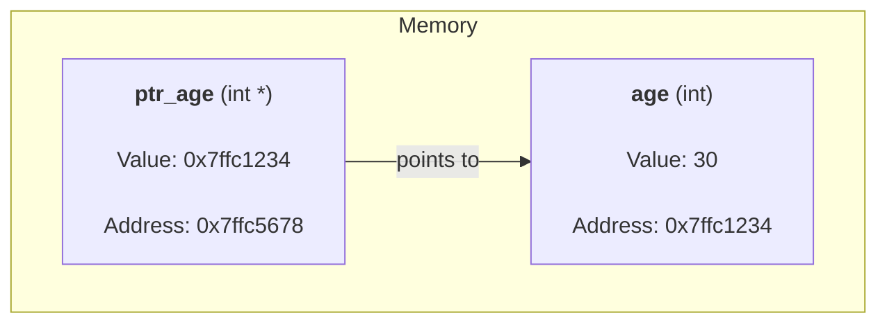
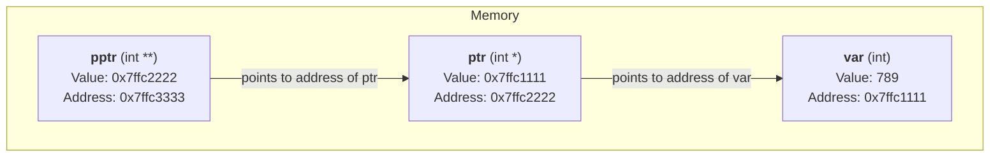
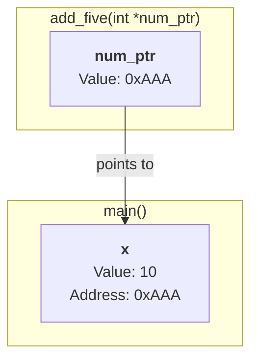
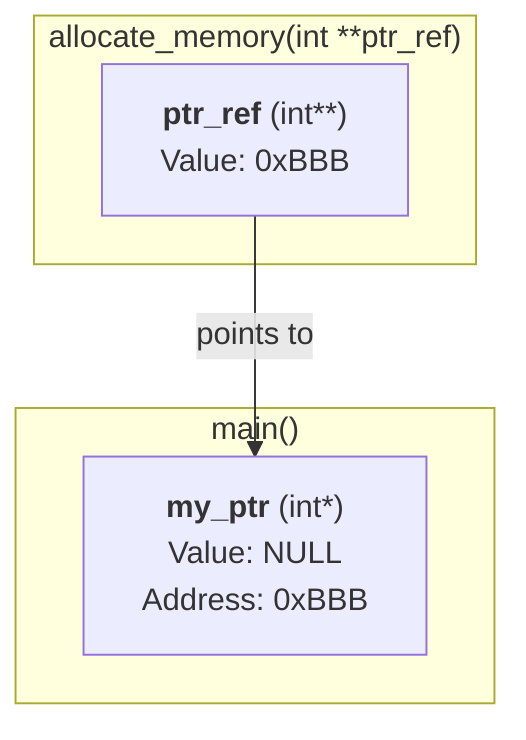

# Lecture 7: Pointers
## {{ $slidev.configs.subject }}
### Semester {{ $slidev.configs.semester }}
#### Presented by {{ $slidev.configs.presenter }}

---

## Lecture Outline

1.  **Pointer Fundamentals** (`&`, `*`)
2.  Pointer Arithmetic and Arrays
3.  Pointers-to-Pointers (Double Pointers)
4.  Passing Pointers to Functions
5.  Dynamic Memory Allocation
6.  Function Pointers

---
layout: two-cols-header
---

## Pointer Fundamentals

::left::

*   So far we've seen data types like `int`, `char`, `float`, and arrays.
*   **Pointer:** A special type of variable whose value is the **memory address** of another variable.
*   Every variable, regardless of its type, resides at a specific memory address.
*   Pointers "point to" the location where data is stored.

```c
int age = 30;
int *ptr_age = &age;
```

::right::
<div style="left:100px;position:relative">

</div>

---

## Pointer Definition Syntax

* Declaring a pointer variable involves specifying the data type it will point to, followed by an asterisk (`*`), and then the pointer variable name.
* **Syntax:** `data_type *pointer_variable_name;`
* The `*` indicates that `pointer_variable_name` is a pointer.
* `data_type` specifies the type of the variable whose address the pointer will store. This is crucial for pointer arithmetic and dereferencing.

```c
int main() {
    int *ptr_to_int;   // Declares a pointer named 'ptr_to_int'
                       // that can hold the address of an integer variable.

    float *ptr_to_float; // Declares a pointer to a float.

    char *ptr_to_char;   // Declares a pointer to a char.

    // ... pointer initialization and usage ...
    return 0;
}
```

---

## Pointer Initialization

* Like regular variables, pointers should be initialized before use.
* **Initialization Methods:**
    1.  **Using the Address-Of Operator (`&`):** Get the memory address of an existing variable and assign it to the pointer.
        ```c
        int my_var = 10;
        int *ptr = &my_var; // 'ptr' now holds the address of 'my_var'
        ```
    2.  **Assigning `NULL`:** Initialize the pointer to `NULL` (often defined as `(void*)0`) to indicate it doesn't point to a valid memory location yet. This is a safe practice.
        ```c
        float *fptr = NULL;
        ```
    3.  **Assigning Another Pointer:** Copy the address stored in another pointer of the compatible type.
        ```c
        int *ptr1 = &my_var;
        int *ptr2 = ptr1; // ptr2 now also points to my_var
        ```
* **Important:** The pointer type must match the variable type (e.g., `int *` points to `int`, `float *` points to `float`).

---

## The Dereference Operator (`*`)

* Used to access or modify the **value stored at the memory address** held by a pointer.
* When `*` is used in front of an initialized pointer variable (not in a declaration), it means "the value pointed to by".
* **Syntax:** `*pointer_variable`
* **Contrast:**
    * `&variable_name`: Gives the *address* of the variable.
    * `*pointer_variable`: Gives the *value* at the address stored in the pointer.

---

## Dereferencing Examples

```c
#include <stdio.h>

int main() {
    int age = 30;
    int *ptr_age = &age; // ptr_age holds the address of age

    // Accessing the value using dereference
    printf("Value of age (direct): %d\n", age);
    printf("Value of age (via pointer): %d\n", *ptr_age); // *ptr_age reads the value at the address

    // Modifying the value using dereference
    *ptr_age = 31; // Changes the value stored at the address ptr_age points to
    printf("New value of age (direct): %d\n", age); // age is now 31

    // Example with another variable
    int value_read;
    value_read = *ptr_age; // Read the value pointed to by ptr_age into value_read
    printf("Value read via pointer: %d\n", value_read); // Output: 31

    return 0;
}
```


---

## Lecture Outline

1.  Pointer Fundamentals (`&`, `*`)
2.  **Pointer Arithmetic and Arrays**
3.  Pointers-to-Pointers (Double Pointers)
4.  Passing Pointers to Functions
5.  Dynamic Memory Allocation
6.  Function Pointers

---

## 🤖 Try This with AI: `p`, `*p`, and `&p`

**Prompt:** *"For `int x = 10; int *p = &x;`, what are the values and types of `p`, `*p`, and `&p`? Draw a memory diagram as text."*

Verify:
```c
int x = 10;
int *p = &x;
printf("p   = %p\n", (void *)p);   // address of x
printf("*p  = %d\n", *p);          // value of x
printf("&p  = %p\n", (void *)&p);  // address of p itself
```

> ⚠️ AI diagrams vary in quality. If the first one confuses you, ask: *"Try again with each box showing the variable name, its address, and its value."*

---

## Pointer Arithmetic

* You can perform arithmetic operations (like `+`, `-`, `++`, `--`) on pointers.
* **Key Concept:** Pointer arithmetic is automatically scaled by the **size of the data type** the pointer points to.
* `pointer + 1`: Does *not* add 1 byte to the address. It adds `1 * sizeof(data_type)` bytes, effectively moving the pointer to the **next element** of that type in memory.
* `pointer - 1`: Subtracts `1 * sizeof(data_type)` bytes.
* This makes pointer arithmetic useful for navigating arrays.

---

## Example: Pointer Arithmetic

```c {*}{maxHeight:'420px'}
#include <stdio.h>

int main() {
    int numbers[] = {10, 20, 30, 40};
    int *ptr_int = numbers; // Points to numbers[0]

    char letters[] = {'A', 'B', 'C', 'D'};
    char *ptr_char = letters; // Points to letters[0]

    double values[] = {1.1, 2.2, 3.3, 4.4};
    double *ptr_double = values; // Points to values[0]

    printf("Initial addresses:\n");
    printf("ptr_int points to address: %p\n", (void*)ptr_int);
    printf("ptr_char points to address: %p\n", (void*)ptr_char);
    printf("ptr_double points to address: %p\n", (void*)ptr_double);

    // Increment each pointer by 1 element
    ptr_int++;    // Moves forward by sizeof(int) bytes (e.g., 4 bytes)
    ptr_char++;   // Moves forward by sizeof(char) bytes (e.g., 1 byte)
    ptr_double++; // Moves forward by sizeof(double) bytes (e.g., 8 bytes)

    printf("\nAddresses after ptr++:\n");
    printf("ptr_int now points to address: %p (value %d)\n", (void*)ptr_int, *ptr_int);
    printf("ptr_char now points to address: %p (value %c)\n", (void*)ptr_char, *ptr_char);
    printf("ptr_double now points to address: %p (value %.1f)\n", (void*)ptr_double, *ptr_double);

    return 0;
}
// Note: %p is used to print addresses (pointers). Casting to (void*) is good practice.
```

---

## Pointers and Arrays Relationship

* In C, there's a very close relationship between pointers and arrays.
* When an array name is used in most expressions (e.g., assigned to a pointer, passed to a function), it **decays** into a pointer to its first element.
* `int arr[10]; int *ptr = arr;` is equivalent to `int *ptr = &arr[0];`
* This allows accessing array elements using pointer notation and arithmetic.
* **Equivalences:**
    * `arr[i]` is equivalent to `*(arr + i)`
    * `&arr[i]` is equivalent to `arr + i`

---

## Accessing Array Elements Using Pointers

```c {*}{maxHeight:'420px'}
#include <stdio.h>

int main() {
    int numbers[] = {100, 200, 300, 400, 500};
    int *ptr = numbers; // ptr points to numbers[0]
    int i;

    printf("Accessing using array notation (numbers[i]):\n");
    for (i = 0; i < 5; i++) {
        printf("numbers[%d] = %d\n", i, numbers[i]);
    }

    printf("\nAccessing using pointer notation (*(ptr + i)):\n");
    ptr = numbers; // Reset pointer to the beginning
    for (i = 0; i < 5; i++) {
        // *(ptr + i) accesses element at index i via pointer arithmetic
        printf("*(ptr + %d) = %d\n", i, *(ptr + i));
    }

    printf("\nAccessing using pointer notation (incrementing ptr):\n");
    ptr = numbers; // Reset pointer
    for (i = 0; i < 5; i++) {
        // *ptr accesses current element, then ptr++ moves to the next
        printf("Value: %d at address %p\n", *ptr, (void*)ptr);
        ptr++;
    }

    return 0;
}
```

---

## Lecture Outline

1.  Pointer Fundamentals (`&`, `*`)
2.  Pointer Arithmetic and Arrays
3.  **Pointers-to-Pointers (Double Pointers)**
4.  Passing Pointers to Functions
5.  Dynamic Memory Allocation
6.  Function Pointers

---
layout: two-cols-header
---

## Pointer to Pointer (Double Pointers)

::left::

*   A pointer can point to another pointer. This is called a **pointer to a pointer** or a **double pointer**.
*   It's a variable that holds the memory address of another pointer variable.
*   **Declaration:** `data_type **pptr;`
*   **Dereferencing:**
    *   `*pptr`: Accesses the pointer it points to (giving you an address).
    *   `**pptr`: Accesses the final value (dereferences twice).

```c
int var = 789;
// Pointer to an int
int *ptr = &var;
// Pointer to a pointer to an int
int **pptr = &ptr;
```

::right::

<div style="left:50px;position:relative">



`*pptr` evaluates to `0x7ffc1111` (the value of `ptr`).
`**pptr` evaluates to `789` (the value of `var`).

</div>


---
layout: two-cols-header
---

## Passing Pointers to Functions

::left::

### 1. To Modify a Variable's Value (Pass-by-Reference)

*   To allow a function to modify a variable passed to it, you must pass a **pointer** to that variable.
*   The function can then dereference the pointer to change the original variable's value.

```c
void add_five(int *num_ptr) {
    *num_ptr = *num_ptr + 5; // Modifies original
}

int main() {
    int x = 10;
    add_five(&x); // Pass address of x
    // Now, x is 15
}
```
::right::



`*num_ptr` accesses `x`.

---
layout: two-cols-header
---


### 2. To Modify the Pointer Itself
:: left ::
*   To change where a pointer points from within a function (e.g., for memory allocation or linked list manipulation), you must pass a **pointer to that pointer** (`**`).


```c
void allocate_memory(int **ptr_ref) {
    *ptr_ref = (int*)malloc(sizeof(int));
}

int main() {
    int *my_ptr = NULL;
    allocate_memory(&my_ptr); // Pass address of my_ptr
    // my_ptr now points to allocated memory
    free(*my_ptr);
}
```
:: right ::


`*ptr_ref` accesses `my_ptr`, allowing the function to change it.

---

## Lecture Outline

1.  Pointer Fundamentals (`&`, `*`)
2.  Pointer Arithmetic and Arrays
3.  Pointers-to-Pointers (Double Pointers)
4.  Passing Pointers to Functions
5.  **Dynamic Memory Allocation**
6.  Function Pointers

---

## Static vs. Dynamic Memory Allocation

* **Static Allocation:** Memory for global variables, static variables, and (conceptually) local variables is allocated by the compiler/loader either at compile time or when a function is called (on the **stack**). The size and lifetime are fixed.
* **Dynamic Allocation:** Allows programs to request blocks of memory of variable size *during runtime* from a memory pool called the **heap**. This memory persists until explicitly deallocated. Essential for data structures that grow or shrink (like linked lists, trees) or when memory needs are unknown until runtime.
* Managed using pointers and library functions from `<stdlib.h>`.

---

## Dynamic Allocation Functions (`<stdlib.h>`)

1.  **`malloc(size_t size)`:** (Memory Allocation)
    * Allocates a block of memory of at least `size` bytes on the heap.
    * Returns a `void*` (generic pointer) to the beginning of the allocated block.
    * Returns `NULL` if allocation fails (e.g., heap is full).
    * The allocated memory is **uninitialized** (contains garbage values).
    * **Usage:** `ptr = (data_type *)malloc(num_elements * sizeof(data_type));`
        * Cast the `void*` result to the desired pointer type.
        * Calculate size using `sizeof()`.
        * **Always check if the returned pointer is `NULL`**.
2.  **`calloc(size_t num, size_t size)`:** (Contiguous Allocation)
    * Allocates memory for an array of `num` elements, each of `size` bytes.
    * Initializes the allocated memory to **zero**.
    * Returns `void*` or `NULL`.

---

## Dynamic Allocation Functions (`<stdlib.h>`) (Cont.)

3.  **`realloc(void *ptr, size_t new_size)`:**
    * Resizes a previously allocated memory block (pointed to by `ptr`) to `new_size`.
    * May move the memory block; returns the new address (or `NULL` on failure).
    * Preserves existing content up to the minimum of the old and new sizes.
4.  **`free(void *ptr)`:**
    * Deallocates a block of memory previously allocated by `malloc`, `calloc`, or `realloc`.
    * The pointer `ptr` must point to the *start* of a dynamically allocated block.
    * **Crucial:** Failure to `free` memory leads to **memory leaks**. Freeing already freed memory or invalid pointers causes undefined behavior.

---

## `malloc` Example: Allocating a Single Integer

```c {*}{maxHeight:'430px'}
#include <stdio.h>
#include <stdlib.h> // Required for malloc, free

int main() {
    int *ptr_int = NULL; // Initialize pointer to NULL

    // Allocate memory for one integer on the heap
    ptr_int = (int *)malloc(sizeof(int));

    // ALWAYS check if malloc succeeded
    if (ptr_int == NULL) {
        printf("Memory allocation failed!\n");
        return 1; // Indicate error
    }

    // Use the allocated memory via the pointer
    *ptr_int = 123;
    printf("Value stored in dynamic memory: %d\n", *ptr_int);

    // Deallocate the memory when done
    free(ptr_int);
    ptr_int = NULL; // Good practice: set pointer to NULL after freeing

    return 0;
}
```

---

## `malloc` Example: Allocating an Array Dynamically

```c {*}{maxHeight:'430px'}
#include <stdio.h>
#include <stdlib.h>

int main() {
    int num_elements = 5;
    int *dyn_array = NULL; // Pointer for the dynamic array
    int i;

    // Allocate memory for 'num_elements' integers
    dyn_array = (int *)malloc(num_elements * sizeof(int));

    // Check allocation result
    if (dyn_array == NULL) {
        printf("Failed to allocate memory for the array.\n");
        return 1;
    }

    // Use the dynamic array like a regular array
    printf("Enter %d integers:\n", num_elements);
    for (i = 0; i < num_elements; i++) {
        // dyn_array[i] is equivalent to *(dyn_array + i)
        scanf("%d", &dyn_array[i]);
    }

    printf("You entered:\n");
    for (i = 0; i < num_elements; i++) {
        printf("%d ", dyn_array[i]);
    }
    printf("\n");

    // IMPORTANT: Free the allocated array memory
    free(dyn_array);
    dyn_array = NULL; // Set pointer to NULL

    return 0;
}
```

---

## 🤖 Try This with AI: Spot the Memory Bug

**Prompt:** *"Find all bugs in this code:"*
```c
int *p = malloc(5 * sizeof(int));
p[0] = 1;
return 0;
```

The AI should flag: **(1)** missing `NULL` check after `malloc`, **(2)** missing `free(p)`.

> ⚠️ AI-generated `malloc` examples frequently omit both. Make it a habit: every `malloc` needs a `NULL` check **and** a matching `free`. No exceptions.

---

## Importance of `free()` - Memory Leaks

* Dynamically allocated memory (from the heap) is **not automatically reclaimed** when pointers go out of scope (unlike stack variables).
* If you allocate memory with `malloc`/`calloc` and lose all pointers to that memory block *without* calling `free()`, that memory becomes inaccessible for the rest of the program's execution. This is a **memory leak**.
* Accumulating memory leaks can exhaust available heap memory, causing future allocations to fail or the program to crash.
* **Rule:** For every successful `malloc`/`calloc`/`realloc`, there should eventually be a corresponding `free()` call when the memory is no longer needed.

---


## Lecture Outline

1.  Pointer Fundamentals (`&`, `*`)
2.  Pointer Arithmetic and Arrays
3.  Pointers-to-Pointers (Double Pointers)
4.  Passing Pointers to Functions
5.  Dynamic Memory Allocation
6.  **Function Pointers**

---

## Function Pointers

* Just like variables, functions also reside in memory and therefore have addresses.
* A **function pointer** is a pointer variable that stores the memory address of a function.
* Allows functions to be treated like data: stored, passed as arguments to other functions, returned from functions.
* Useful for implementing callbacks, creating dispatch tables (like virtual functions in OOP), and generic algorithms.

---

## Function Pointer Declaration Syntax

* The declaration must match the **signature** (return type and parameter types) of the functions it can point to.
* **Syntax:** `return_type (*pointer_name)(parameter_type_list);`
* **Key elements:**
    * `return_type`: The return type of the function being pointed to.
    * `(*pointer_name)`: The name of the pointer variable, enclosed in parentheses and preceded by `*`. The parentheses are crucial to distinguish it from a function declaration returning a pointer.
    * `(parameter_type_list)`: The list of parameter types the function takes.

```c
// Example: Declare a pointer 'pFunc' that can point to functions
// which take two integers as input and return an integer.
int (*pFunc)(int, int);

// Example: Pointer to a function taking no args, returning void
void (*callback_ptr)(void);

// Example: Pointer to a function taking float*, returning double
double (*process_data_ptr)(float *);
```

---

## Assigning and Using Function Pointers

* **Assignment:** Assign the address of a compatible function using the function name (which decays into a pointer, similar to arrays) or explicitly using the address-of operator `&`.
    ```c
    int add(int a, int b) { return a + b; }
    int subtract(int a, int b) { return a - b; }

    int (*operation_ptr)(int, int); // Declare function pointer

    operation_ptr = add;      // Assign address of add function
    // OR
    operation_ptr = &subtract; // Assign address of subtract function
    ```
* **Calling:** Call the function through the pointer using syntax similar to a regular function call, or by explicitly dereferencing the pointer first (less common).
    ```c
    int result1 = operation_ptr(10, 5); // Call function via pointer (preferred)
    int result2 = (*operation_ptr)(20, 8); // Explicit dereference also works
    ```

---

## Example: Using Function Pointers

```c {*}{maxHeight:'430px'}
#include <stdio.h>

// Functions with matching signatures
int add(int a, int b) { return a + b; }
int multiply(int a, int b) { return a * b; }

// Function that takes a function pointer as an argument
void perform_operation(int x, int y, int (*op_func)(int, int)) {
    int result = op_func(x, y); // Call the passed function via pointer
    printf("Operation result: %d\n", result);
}

int main() {
    // Declare a function pointer
    int (*calculator_ptr)(int, int);

    // Assign 'add' to the pointer
    calculator_ptr = add;
    printf("Calling via pointer (add): %d\n", calculator_ptr(5, 3)); // Output: 8

    // Assign 'multiply' to the pointer
    calculator_ptr = multiply;
    printf("Calling via pointer (multiply): %d\n", calculator_ptr(5, 3)); // Output: 15

    // Pass function pointers as arguments (Callbacks)
    printf("\nUsing perform_operation:\n");
    perform_operation(10, 2, add);      // Pass 'add' function
    perform_operation(10, 2, multiply); // Pass 'multiply' function

    return 0;
}
```


---
layout: two-cols
---

## Summary
*   **Pointer Fundamentals:** Variables that store memory addresses. Key operators are:
    *   `&` (Address-Of): Gets the memory address of a variable.
    *   `*` (Dereference): Accesses the value at the address a pointer holds.
*   **Pointers & Arrays:** `arr[i]` is equivalent to `*(arr + i)`. Pointer arithmetic is scaled by the element size.
*   **Pointers-to-Pointers (`**`):** Hold the address of another pointer, useful for letting a function change where a pointer points.

:: right ::
*   **Passing Pointers to Functions:** Enables pass-by-reference -- a function can modify a caller's variable through a pointer parameter.
*   **Dynamic Memory Allocation (`<stdlib.h>`):**
    *   `malloc()`: Allocates a block of memory on the heap. Returns a pointer or `NULL` on failure.
    *   `free()`: Deallocates memory to prevent memory leaks. Every `malloc` needs a corresponding `free`.
*   **Function Pointers:** Store the address of a function, allowing them to be passed as arguments (callbacks) or stored.
*   **Next:** in Lecture 8 you will see how `char *` makes string handling more natural, and in Lecture 9 how `struct *` with the `->` operator lets you pass records efficiently.